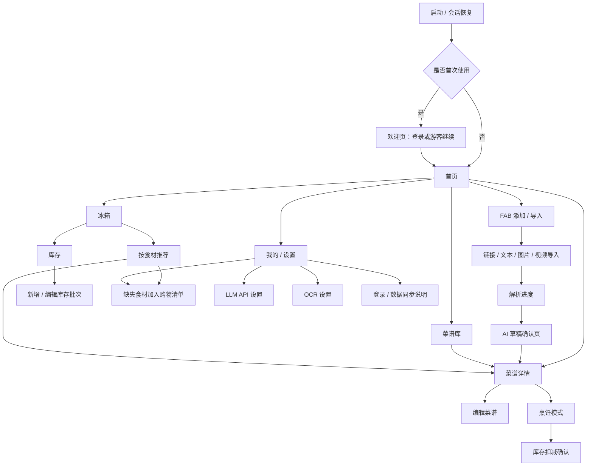
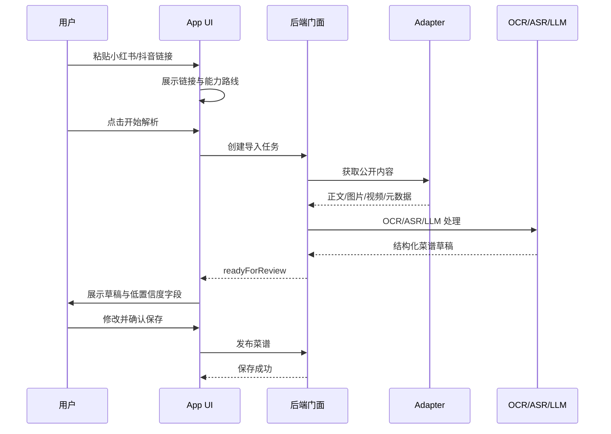

# AI 食谱移动端 UI 设计交付文档

> 文档状态：v0.3 / UI 设计前置交付稿  
> 更新时间：2026-08-04  
> 适用对象：UI/UX 设计师、Flutter 前端开发、产品走查  
> 关联用户故事：US-001 ~ US-013，重点为 US-004、US-005、US-009、US-010、US-011、US-012、US-013  
> 设计产物保存位置：`design/flows/`、`design/wireframes/`、`design/ui/`、`design/prototypes/`

---

## 1. 交付目标

本文件用于把 AI 食谱应用的产品与后端能力翻译成可设计、可走查、可开发的移动端 UI 需求。交付给设计或前端时，应以本文件作为 UI 设计入口，再结合：

1. `AGENTS.md`：项目长期协作规则。
2. `docs/product/USER_STORIES.md`：用户故事和验收标准。
3. `docs/architecture/APPLICATION_BACKEND_FACADE.md`：前端后续对接的统一后端门面。
4. `docs/architecture/APP_ACCESS_CAPABILITIES.md`：游客 / 登录能力差异。
5. `docs/architecture/LOCAL_LLM_NETWORK_SECURITY.md`：自定义 LLM API 设置。
6. `docs/architecture/OCR_PLUGIN.md`：本地 OCR / 云 OCR / 插件状态。
7. `design/reviews/DESIGN_REVIEW_CHECKLIST.md`：设计验收清单。

本文件只定义 UI 和交互要求，不要求设计师修改代码。

---

## 2. 产品定位与 UI 关键词

### 2.1 产品一句话

把分散的图文 / 视频菜谱转换成个人结构化菜谱库，并用冰箱库存帮助用户决定现在能做什么、缺什么和如何减少浪费。

### 2.2 移动端优先原则

- 优先支持 iOS / Android 手机。
- 平板可复用移动端布局，但详情页、编辑页和烹饪模式可以做双栏增强。
- UI 必须适配竖屏为主；横屏不是 MVP 必需，但烹饪模式后续可支持。
- 支持游客模式，不强制登录。
- 登录用户和游客看到的功能入口可以相同，但不可用能力必须说明原因和替代方案。

### 2.3 视觉关键词

建议方向，不是最终视觉限制：

- 温暖、干净、厨房感。
- 卡片式菜谱库。
- 食材和步骤结构清晰。
- AI 生成结果必须有“待确认”“可编辑”“来源证据”的感觉，不能表现为百分百正确。
- 错误和降级流程要友好，避免技术化恐吓。

---

## 3. MVP 信息架构

底部导航采用 4 个一级入口：

| 导航 | 名称 | 主要目的 | 优先级 |
|---|---|---|---|
| Tab 1 | 首页 | 最近菜谱、常用分类、继续烹饪、全局入口 | P0 |
| Tab 2 | 菜谱库 | 全部正式菜谱、分类、搜索、收藏、回收站入口 | P0 |
| Tab 3 | 冰箱 | 库存批次、临期筛选、按食材推荐本地菜谱 | P1 |
| Tab 4 | 我的 | 登录、购物清单、LLM/OCR 设置、隐私与数据 | P0 |

添加和导入不占用 Tab，继续使用全局右下角 FAB；购物清单是二级页面。首版不增加第五个 Tab。

### 3.1 页面树



---
## 4. 全局布局规范

### 4.1 设备尺寸基线

设计时至少覆盖：

| 设备类型 | 参考宽度 | 要求 |
|---|---:|---|
| 小屏手机 | 360px | 主要按钮不可被挤出；菜名长文本可换行 |
| 标准手机 | 390px / 393px | 默认主设计尺寸 |
| 大屏手机 | 430px | 卡片间距和内容密度自然扩大 |
| 平板竖屏 | 768px | 可先居中单栏，后续再做双栏 |

Flutter 实现时应支持系统字体缩放，所以不要依赖固定高度承载长文本。

### 4.2 全局导航行为

- 底部导航只承载“首页 / 菜谱库 / 冰箱 / 我的”四个一级入口。
- 添加 / 导入通过全局 FAB 到达，购物清单使用二级页面，不再占用一级导航。
- 菜谱详情、编辑页、解析进度、烹饪模式使用页面级导航，不放进底部 Tab。
- 重要编辑行为离开前需要二次确认：导入草稿未保存、编辑菜谱未保存、删除菜谱。
- 烹饪模式应尽量避免误触返回；返回时提示“是否退出烹饪模式”。

### 4.3 全局状态

每个核心页面至少覆盖：

- 默认态。
- 空状态。
- 加载态。
- 成功态。
- 错误态。
- 弱网 / 离线态。
- 权限拒绝态。
- 极限内容态。
- 游客态。
- 登录态。

---

## 5. 关键页面 UI 要求

### UI-001 欢迎页 / 会话入口

**目标**：让用户理解可以游客使用，也可以登录获得云端能力。

**核心内容**：

- 产品名称与一句话说明。
- 主按钮：`登录 / 注册`。
- 次按钮：`游客继续`。
- 说明文案：游客可使用本地菜谱、自定义 LLM API、本地 OCR；不能使用云同步和平台托管 AI 服务。

**状态要求**：

| 状态 | UI 要求 |
|---|---|
| 默认 | 展示两个明确入口，不能强迫登录 |
| 登录失败 | 显示安全的失败原因，不暴露服务端细节 |
| 离线 | 登录不可用，但游客继续可用 |
| 极限 | 隐私说明长文本可折叠 |

---

### UI-002 首页

**目标**：让用户快速导入菜谱、继续查看最近菜谱。

**核心模块**：

1. 顶部问候 / 当前状态。
2. 快速导入卡片：粘贴链接、从剪贴板导入、拍照 / 选图、手动创建。
3. 最近查看 / 最近导入菜谱。
4. 分类快捷入口。
5. 收藏菜谱入口。
6. 如果存在未完成导入任务，显示“继续处理”。

**空状态**：

- 标题：`还没有菜谱`
- 说明：`粘贴小红书 / 抖音链接，或手动创建第一道菜。`
- 主按钮：`导入菜谱`
- 次按钮：`手动创建`

**极限状态**：

- 菜名过长：卡片最多显示 2 行，详情页显示完整名称。
- 图片缺失：使用默认食物占位图或纯色占位卡。
- 分类很多：横向滚动或“更多分类”。

---

### UI-003 添加入口

**目标**：承载所有创建菜谱方式。

**入口类型**：

| 入口 | 说明 | 登录要求 |
|---|---|---|
| 粘贴链接 | 小红书 / 抖音公开链接 | 不要求登录 |
| 粘贴文本 | 用户手动复制正文 | 不要求登录 |
| 导入图片 | 菜谱截图 / 食材图 | 取决于 OCR Provider |
| 导入视频 | 本地视频 / 平台视频降级 | 取决于 ASR / OCR / LLM 能力 |
| 手动创建 | 直接编辑菜谱结构 | 不要求登录 |

**剪贴板检测**：

- 如果剪贴板有疑似链接：首页或添加页可提示“检测到链接，是否导入？”
- 不应自动读取后直接发起网络请求，必须让用户确认。

---

### UI-004 链接导入 / 内容导入页

**目标**：让用户输入来源，并在开始前知道会用到哪些能力。

**表单字段**：

- 链接输入框。
- 来源平台自动识别标签：小红书 / 抖音 / 未知平台。
- 可选：备注、目标分类。
- 能力路线提示：自定义 LLM、本地 OCR、云 OCR、托管 AI 等。

**按钮**：

- 主按钮：`开始解析`
- 次按钮：`改为手动创建`

**能力不可用提示**：

| 场景 | UI 处理 |
|---|---|
| 游客未配置 LLM API | 引导去 `LLM API 设置`，也可改为手动创建 |
| 本地 OCR 未安装 | 引导安装插件 / 模型，或选择云 OCR / 手动粘贴文本 |
| 登录用户云端额度不足 | 显示额度不足，并提供自定义 API 或手动创建替代 |
| 禁止上传图片 | 不显示诱导上传云 OCR 的文案，只提示可使用本地 OCR 或手动录入 |

---

### UI-005 解析进度页

**目标**：让用户理解 AI 导入不是卡住，而是在分阶段处理。

**进度阶段建议文案**：

| 阶段 | 文案 |
|---|---|
| queued | `已加入解析队列` |
| fetching | `正在获取公开内容` |
| extracting | `正在整理正文、图片和视频信息` |
| ocr | `正在识别图片中的文字` |
| asr | `正在识别视频 / 音频中的口播` |
| generating | `正在生成结构化菜谱` |
| validating | `正在检查结果格式` |
| readyForReview | `解析完成，请确认后保存` |
| failed | `解析失败，可选择降级方式继续` |
| cancelled | `已取消解析` |

**交互要求**：

- 显示整体进度条或阶段列表。
- 显示当前阶段说明，不只显示百分比。
- 提供 `取消`。
- 取消后返回添加页，并保留原链接。
- 长任务允许离开页面，首页显示未完成任务入口。

**失败降级入口**：

- `粘贴正文继续`
- `上传截图继续`
- `上传视频继续`
- `手动创建菜谱`
- `稍后重试`

---

### UI-006 AI 草稿确认页

**目标**：AI 结果必须经过用户确认才能保存。

**结构**：

1. 顶部：菜名、来源平台、原链接、解析状态。
2. 低置信度提醒条：例如 `有 3 处内容需要确认`。
3. 菜谱预览：封面、分类、标签、份量、耗时、难度。
4. 食材区：食材名、用量、备注。
5. 步骤区：步骤序号、操作、时间、火候、关联食材。
6. 原始证据入口：查看来源文本、图片 OCR 片段、视频口播片段。
7. 底部操作：保存菜谱、继续编辑、重新生成、放弃草稿。

**低置信度字段表现**：

- 不能只用颜色；必须有图标或文字标签。
- 点击字段可查看“AI 为什么这么填”：原文片段 / OCR 文本 / ASR 文本。
- 用户修改后低置信度标记消失或转为“已确认”。

**重要规则**：

- 不允许 AI 结果直接覆盖已有菜谱。
- 保存前必须可编辑。
- 放弃草稿需要确认。

---

### UI-007 菜谱详情页

**目标**：清晰展示一个已保存菜谱，支持开始做菜。

**核心内容**：

- 封面图。
- 菜名、收藏、更多操作。
- 分类、标签、份量、总耗时、难度。
- 来源信息：平台、链接、导入时间。
- 食材列表。
- 操作步骤。
- 备注 / 小贴士。
- 底部主按钮：`开始烹饪`。
- 次操作：编辑、复制、删除、移动分类。

**状态要求**：

| 状态 | UI 要求 |
|---|---|
| 默认 | 食材和步骤分区明确 |
| 图片缺失 | 有占位，不影响阅读 |
| 超长步骤 | 可以展开 / 收起或自然滚动 |
| 已删除 | 不在正常列表展示，回收站中展示恢复入口 |
| 离线 | 已保存菜谱仍可完整查看 |

---

### UI-008 编辑菜谱页

**目标**：用户可以手动修正 AI 结果或从零创建菜谱。

**编辑字段**：

- 菜名。
- 封面图。
- 分类。
- 标签。
- 份量。
- 总耗时。
- 难度。
- 食材列表：增删改、排序。
- 步骤列表：增删改、排序；每步可填时间、火候、备注。
- 来源链接和备注。

**交互要求**：

- 食材和步骤支持新增、删除、拖拽或上下移动。
- 未保存离开必须提示。
- 手动创建不需要 AI 能力。
- 保存失败时不能丢失已输入内容。

---

### UI-009 菜谱库 / 分类 / 搜索

**目标**：让用户管理长期积累的菜谱。

**菜谱库功能**：

- 全部菜谱列表。
- 分类筛选。
- 收藏筛选。
- 搜索：菜名、食材、标签、备注。
- 排序：最近更新、最近查看、创建时间、名称。
- 回收站入口。

**分类管理**：

- 新建分类。
- 重命名分类。
- 删除分类。
- 移动菜谱到分类。

**回收站**：

- 恢复菜谱。
- 永久删除二次确认。
- 清空回收站二次确认。

---

### UI-010 烹饪模式

**目标**：用户在厨房中可以按步骤做菜。

**核心设计**：

- 一屏突出一个当前步骤。
- 大字号。
- 显示当前步骤所需食材。
- 显示火候、时间、注意事项。
- 上一步 / 下一步按钮足够大。
- 含时间步骤提供 `启动计时器`。
- 多计时器并存时清楚显示对应步骤。

**厨房场景要求**：

- 操作区域尽量靠下，方便单手点击。
- 支持系统字体缩放和高对比度。
- 计时结束有本地提醒。
- 无网络可用。
- 防误触退出。

---

### UI-011 我的 / 设置

**目标**：集中处理登录、能力配置和隐私说明。

**模块**：

1. 当前身份：游客 / 已登录。
2. 登录入口或账号信息。
3. 数据同步状态：游客不可云同步，登录后可同步。
4. LLM API 设置。
5. OCR 设置。
6. 隐私与上传设置。
7. 数据导出 / 备份入口（P1）。
8. 关于与版本。

---

### UI-012 LLM API 设置页

**目标**：让用户通过 API 地址 + Key 配置不同 LLM 协议。

**字段**：

- 协议类型：OpenAI-compatible、Gemini、其他兼容协议。
- API Base URL。
- API Key，可为空。
- 模型名称。
- 请求超时。
- 测试连接按钮。
- 保存按钮。

**安全要求**：

- 已保存的 API Key 不回填明文。
- Key 输入框应支持清空和重新填写。
- 测试失败显示稳定错误，不暴露完整请求头、Key 或模型响应。
- 游客可使用自定义 LLM API。

---

### UI-013 OCR 设置页

**目标**：管理本地 OCR、云 OCR 和插件能力。

**模块**：

| 模块 | UI 要求 |
|---|---|
| 当前 OCR 路线 | 本地 OCR / 云 OCR / 未配置 |
| 本地 OCR 插件 | 显示运行时可用性、模型安装状态、版本、占用空间 |
| 模型安装 | 下载、进度、取消、空间不足、失败重试 |
| 云 OCR | 登录要求、额度、隐私提示 |
| 插件说明 | 说明本地 OCR 可能需要下载模型 |

**当前技术事实**：

- Android 本地 OCR 目前只完成 ONNX Runtime 健康检查。
- 真实图片识别尚未完成。
- `recognitionSupported` 当前为 false。
- UI 不应把本地 OCR 展示为“可识别图片”的完成状态，应展示为“运行时验证中 / 识别能力待启用”。

---

### UI-014 冰箱库存

**目标**：让用户像打开真实冰箱一样快速看懂家中有什么、放在哪里、哪些食材需要优先处理，同时保持移动端列表的可扫读性。

**视觉方向**：

- 采用“轻拟物 + 清晰卡片”，不做重拟物材质；背景可使用浅冷色或柔和灰白，分区卡片用圆角、层架分隔线和抽屉感表达冰箱结构。
- 页面顶部显示“我的冰箱”、可用食材数、临期提醒和“选择食材推荐”入口。
- 主体按真实冰箱心智分区：冷藏区、冷冻区、常温区、其他区。冷藏区可做层架，冷冻区可做抽屉，常温区用于米面粮油，其他区用于待整理或自定义位置。
- 食材用 chip / 小卡片展示，包含名称、数量、单位、临期/过期 badge、数量未知状态和批次数提示。

**页面结构**：

1. 顶部二级切换：库存 / 推荐。
2. 冰箱摘要：可用批次数、临期数、已过期数、数量未知数。
3. 分区卡片：冷藏区、冷冻区、常温区、其他区；每个区支持展开/收起和区内新增。
4. 快捷筛选：全部、临期、已过期、数量未知、冷藏、冷冻、常温、其他。
5. 同名食材可聚合展示，但必须能展开到具体批次。
6. 右下角新增食材按钮；空分区内也提供“放入这个区域”按钮。

**库存卡片信息**：

- 食材名称、数量与单位。
- 存放区域和批次数。
- 到期日期或“未设置日期”。
- 正常 / 临期 / 已过期 / 数量未知状态。
- 编辑、标记用完、标记丢弃。

**关键状态**：

- 空状态：展示空冰箱分区插画或空层架，引导“添加第一样食材”。
- 空分区：每个分区单独显示“把食材放进冷藏区 / 冷冻区”。
- 加载态：分区骨架屏，避免整页空白。
- 错误态：本地数据库错误提供重试，不丢失输入。
- 离线态：库存完整可用，不显示网络错误。
- 极限态：超长名称、同名多批次、100+ 批次、无数量、无日期。
- 游客 / 登录：本地能力一致；登录用户额外显示同步状态。

**专项交付**：拖拽状态机、最终提交触发边界、二维逐格冷冻/解冻、失败恢复与减少动态规则以 `flows/FRIDGE_DRAG_AND_FROST_ANIMATION_HANDOFF.md` 为唯一详细事实源，本节不重复维护。

---

### UI-015 库存批次新增 / 编辑

**目标**：用最少字段完成一次库存记录，同时允许需要精确管理的用户补充日期、批次和存放区域信息。

**字段**：

- 食材名称，必填。
- 数量，可为空。
- 单位，可为空。
- 分类。
- 存放位置：冷藏区、冷冻区、常温区、其他区；默认跟随用户从哪个分区点击“添加”。
- 购买日期，可为空。
- 到期日期，可为空。
- 备注。

**交互规则**：

- 存放位置使用分段按钮或冰箱小地图，让用户明确“放进哪个区”。
- 同名食材提示“已有其他批次”，但不强制合并。
- 数量为空时保存为“数量未知”，不得默认写 0。
- 删除、标记用完和标记丢弃需明确作用于当前批次。
- 未保存离开需要确认。

---

### UI-016 按食材推荐与库存扣减确认

**目标**：先让用户选择本次想用的冰箱食材，再解释推荐为什么出现、还缺什么，并在做完菜后由用户确认库存变化。

**推荐页结构**：

1. 选择食材区：从冷藏区、冷冻区、常温区、其他区点选食材 chip。
2. 快捷选择：全部、临期优先、冷藏区、冷冻区、清空选择。
3. 底部固定 CTA：“用已选食材推荐”；未选择时提示先选择或允许“一键用全部库存推荐”。
4. 推荐结果分组：已具备 / 现在就能做、缺 1 样、缺 2 样、优先清库存；缺失超过 2 样默认折叠到“更多缺失”。

**推荐卡片**：

- 已选命中：用户本次选择并命中的食材。
- 冰箱已有但未选择：例如用户只选西红柿时，西红柿炒鸡蛋中的鸡蛋若在库存中，应标记为“冰箱已有，可补选 / 可用”。
- 缺失项：按缺 1 样、缺 2 样展示，可加入购物清单。
- 临期消耗提示：命中临期食材时突出“可优先消耗”。
- 匹配食材数 / 主要必需食材总数、推荐原因、烹饪时间、难度。
- 查看详情、开始烹饪、缺失项加入购物清单。
- 数量未知或单位不可换算时显示“有该食材，数量是否足够需确认”。

**示例状态**：

- 冰箱有西红柿和鸡蛋，用户只选择西红柿：推荐“西红柿炒鸡蛋”，卡片显示“已选命中：西红柿；冰箱已有：鸡蛋；缺失：无”。
- 冰箱只有西红柿，用户选择西红柿：同一菜谱进入“缺 1 样”，显示“缺失：鸡蛋”。

**扣减确认面板**：

- 完成烹饪后自动生成预计消耗列表，但不直接扣减库存。
- 使用底部 sheet 展示食材、预计用量、目标批次、剩余量和异常提示。
- 每项可勾选、改数量、更换批次或取消扣减。
- 默认选择到期更早的批次，但必须展示并允许修改。
- 主按钮使用“确认并更新冰箱”；次要操作为“暂不更新”。
- 未确认、取消或关闭面板时库存保持不变。

**关键状态**：

- 无库存：引导添加食材。
- 未选食材：强调选择入口和快捷用全部库存推荐。
- 无匹配：说明本地正式菜谱中暂无合适结果，可继续维护库存或浏览菜谱库。
- 离线：本地匹配正常工作。
- 无 LLM：本地推荐正常工作；“用现有食材生成新菜谱”入口不可用并解释原因。
- 超长缺失清单、大量推荐和同义词未识别：允许查看详情与反馈，不虚假标记“能做”。

---
## 6. AI 导入核心流程

### 6.1 主流程



### 6.2 降级流程

| 失败点 | 用户看到什么 | 可选动作 |
|---|---|---|
| 链接无法访问 | `暂时无法获取公开内容` | 粘贴正文、上传截图、手动创建、稍后重试 |
| 平台不支持 | `暂不支持该平台自动解析` | 粘贴正文、手动创建 |
| OCR 不可用 | `图片文字识别不可用` | 安装本地 OCR、使用云 OCR、手动输入 |
| LLM 未配置 | `需要配置 AI 生成服务` | 去设置、自定义 API、手动创建 |
| 生成结果格式错误 | `AI 结果需要重新生成` | 重试、切换模型、手动编辑 |
| 用户取消 | `已取消，本次内容未保存` | 返回添加页 |

---

## 7. 游客与登录差异

| 功能 | 游客 | 登录用户 | UI 说明 |
|---|---|---|---|
| 本地菜谱库 | 可用 | 可用 | 都应展示完整本地能力 |
| 冰箱库存批次 | 可用 | 可用 | 游客本地保存；登录用户可显示同步状态 |
| 根据库存推荐本地菜谱 | 可用 | 可用 | 离线确定性匹配，不依赖托管 AI |
| 手动创建菜谱 | 可用 | 可用 | 不应要求登录 |
| 公开链接导入 | 可用 | 可用 | 但 AI Provider 路线不同 |
| 自定义 LLM API | 可用 | 可用 | 用户自己填写 API 地址和 Key |
| 本地 OCR 插件 | 可用 | 可用 | 取决于设备能力和模型安装 |
| 云 OCR | 不可用或受限 | 可用 | 游客提示登录或配置自有 OCR API |
| 平台托管 AI | 不可用 | 可用 | 游客提示登录或配置自定义 LLM |
| 云同步 / 云备份 | 不可用 | 可用 | 游客提示“仅保存在本机” |
| 合并游客数据 | 登录后可触发 | 已登录后完成 | 需要清晰解释不会覆盖已有数据 |

---

## 8. 组件清单

设计时建议沉淀以下组件，便于 Flutter 复用：

| 组件 | 用途 |
|---|---|
| RecipeCard | 首页 / 菜谱库卡片 |
| CategoryChip | 分类筛选和详情展示 |
| SourceBadge | 小红书 / 抖音 / 手动 / 图片 / 视频 |
| ConfidenceBadge | 低置信度 / 已确认 |
| ImportStageStepper | 解析进度阶段展示 |
| CapabilityNotice | 游客、登录、Provider 不可用提示 |
| IngredientRow | 食材列表行 |
| CookingStepCard | 步骤卡片 |
| TimerPanel | 烹饪计时器 |
| EmptyState | 空状态 |
| ErrorState | 稳定错误和降级动作 |
| SecureApiKeyField | API Key 输入和已保存状态 |
| ModelInstallCard | OCR 模型安装状态 |
| PantryBatchRow | 库存批次与聚合展开 |
| ExpiryBadge | 正常、临期、已过期、未设置日期状态 |
| RecommendationRecipeCard | 匹配数、缺失项、临期食材和推荐原因 |
| ConsumptionConfirmSheet | 下厨完成后的逐项扣减确认 |

---

## 9. 文案基调

### 9.1 推荐文案

- `解析完成，请确认后保存`
- `AI 可能会识别错误，请检查食材和步骤`
- `这部分内容置信度较低，建议确认`
- `游客模式下数据仅保存在本机`
- `你可以配置自己的 LLM API，无需登录也能使用 AI 生成`
- `当前本地 OCR 识别能力尚未启用，可先使用手动输入或云 OCR`

### 9.2 避免文案

- 避免说 `AI 已自动保存`。
- 避免说 `100% 准确`。
- 避免把游客能力说成“不可用”，应说明“云端能力不可用，本地能力仍可用”。
- 避免暴露内部错误、完整 API 响应、Key、Prompt。

---

## 10. 设计交付物要求

### 10.1 第一阶段：低保真必交付

优先交付线框图，不要直接进入视觉精修。

必交付：

1. 欢迎页 / 游客继续。
2. 首页空状态和有菜谱状态。
3. 添加入口。
4. 链接导入页。
5. 解析进度页。
6. AI 草稿确认页。
7. 菜谱详情页。
8. 编辑菜谱页。
9. 菜谱库 / 分类管理。
10. 烹饪模式。
11. 我的 / LLM 设置 / OCR 设置。
12. 冰箱库存默认、空、筛选和同名多批次状态。
13. 库存批次新增 / 编辑。
14. 按食材推荐和库存扣减确认。

### 10.2 第二阶段：关键状态补齐

每个关键流程必须补：

- 加载态。
- 错误态。
- 空状态。
- 极限长内容。
- 游客能力不足。
- 登录用户能力可用。
- 离线 / 弱网。

### 10.3 第三阶段：视觉稿或 HTML 原型

可以选择：

- PNG / JPG / SVG 图片。
- 可本地打开的 HTML 原型。
- 两者结合。

文件命名建议：

```text
<设计ID>-<页面>-<状态>-v<版本>.<png|jpg|svg|html|md>
```

例如：

```text
DESIGN-001-import-progress-ocr-v0.png
DESIGN-002-home-empty-v0.png
DESIGN-004-cooking-step-timer-v0.html
```

---

## 11. 设计验收标准

设计交付前必须自查：

- [ ] 所有 P0 页面都有默认态。
- [ ] 冰箱库存、推荐和扣减确认覆盖默认、空、加载、错误、离线、极限、游客和登录状态。
- [ ] 导航明确为“首页 / 菜谱库 / 冰箱 / 我的”，添加 / 导入通过 FAB 到达。
- [ ] 数量未知或单位不可换算时不显示“食材足够”。
- [ ] 未确认扣减时库存保持不变。
- [ ] 首页、导入、草稿确认、详情、烹饪模式都有空 / 加载 / 错误 / 极限状态。
- [ ] 游客和登录用户差异明确。
- [ ] AI 导入失败有降级路径。
- [ ] 低置信度字段可被识别、可查看证据、可编辑。
- [ ] LLM API Key 不展示明文回填。
- [ ] OCR 设置没有把未完成的本地识别能力误展示为可用。
- [ ] 小屏手机可用。
- [ ] 支持系统字体缩放。
- [ ] 颜色不是唯一状态提示。
- [ ] 底部安全区、键盘弹出和长列表行为明确。

---

## 12. 当前待设计任务对应关系

| 任务 | 设计范围 | 建议先交付 |
|---|---|---|
| DESIGN-001 | 链接导入全流程 | 添加入口、导入页、进度页、草稿确认、失败降级 |
| DESIGN-002 | 首页与菜谱管理 | 首页、菜谱库、分类、搜索、回收站、详情 |
| DESIGN-003 | LLM 与 OCR 设置 | 我的、LLM API 设置、OCR 模型安装 / 状态 |
| DESIGN-004 | 烹饪模式 | 步骤大卡、计时器、多计时器、退出确认 |
| DESIGN-005 | 冰箱与按食材推荐 | 四栏导航、库存批次、临期筛选、推荐分组、扣减确认 |

---

## 13. 给设计交付人的工作顺序建议

1. 先读本文件和 `docs/product/USER_STORIES.md`。
2. 先画 `DESIGN-001` 链接导入全流程低保真。
3. 再画 `DESIGN-002` 首页、菜谱库和详情。
4. 再画 `DESIGN-004` 烹饪模式。
5. 接着画 `DESIGN-005` 冰箱库存、推荐和扣减确认。
6. 最后补 `DESIGN-003` 设置页，因为设置页依赖后端能力文案。
7. 每个设计版本完成后，用 `design/reviews/DESIGN_REVIEW_CHECKLIST.md` 走查。
8. 走查通过后再进入高保真或 HTML 原型。

---

## 14. 当前明确不做或暂缓

- 不先做完整品牌视觉系统。
- 不先做复杂社区、分享广场或推荐流。
- 不把周菜单、营养统计作为 MVP 主流程。
- 冰箱已进入 P1 规划，但本轮不实施业务代码。
- 首版不做条码 / 拍照 / 小票识别、后台到期通知、家庭实时共享或未确认自动扣减。
- 不要求 UI 直接对接 SQLite、HTTP Client 或供应商 SDK。
- 不把本地 OCR 真实识别展示为已完成能力。

---

## 15. 可扩展功能占位

后续可以补充但不影响 MVP：

- 购物清单：从多个菜谱汇总食材。
- 周菜单：按日期安排菜谱。
- 营养估算：热量、蛋白质、脂肪、碳水。
- 家庭共享：登录后共享菜谱库。
- 根据库存生成新菜谱：有可用 LLM Provider 时进入独立草稿确认流程，不与本地推荐混排。
- 冰箱增强：后台到期提醒、条码 / 拍照 / 小票识别、家庭共享。
- 做菜记录：完成时间、评分、下次调整建议。