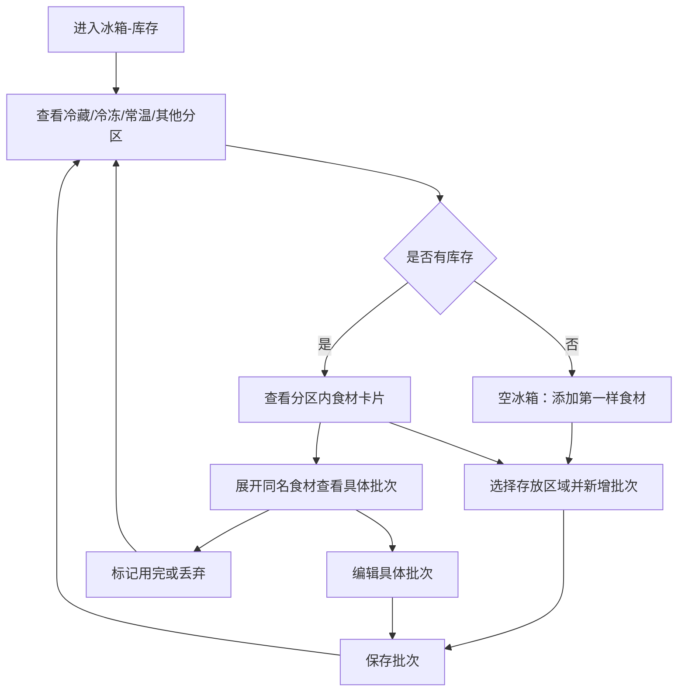
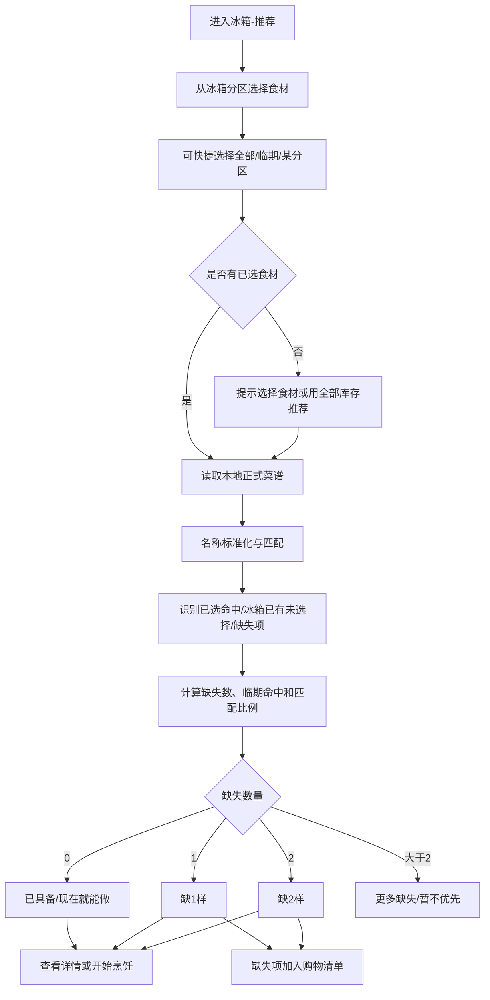
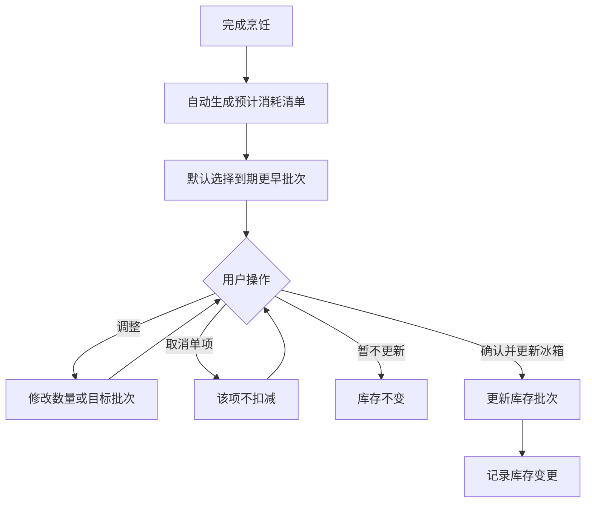

# 冰箱与按食材推荐菜谱流程

> 状态：v0.1 / 需求已补充 UI 方向，待低保真
> 日期：2026-08-04
> 关联：FRIDGE-001、DESIGN-005、US-011、US-012、US-013、ADR-0020、SPK-008

## 1. 目标

在不依赖登录、网络或 LLM 的前提下，让用户像管理真实冰箱一样维护家中食材库存，并从本地正式菜谱中找到“现在能做”“缺 1 样”“缺 2 样”或“优先消耗临期食材”的菜谱。

## 2. 信息架构与 UI 心智

底部一级导航：

```text
首页 / 菜谱库 / 冰箱 / 我的
```

添加与导入继续使用全局 FAB；购物清单是二级页面。冰箱内使用二级切换：

```text
冰箱
├── 库存
└── 推荐
```

库存首页采用“轻拟物冰箱分区”布局：

```text
我的冰箱（库存摘要 / 临期提醒）
├── 冷藏区（层架）
├── 冷冻区（抽屉）
├── 常温区（米面粮油等）
└── 其他区（待整理 / 自定义）
```

设计原则：用分区、层架、抽屉和食材 chip 建立真实冰箱心智，但保持卡片化、可扫读和可操作，避免重拟物影响效率。

## 3. 库存批次流程



### 3.1 批次字段

- 食材名称，必填。
- 数量，可为空；为空时显示“数量未知”。
- 单位，可为空。
- 分类。
- 存放位置：冷藏区、冷冻区、常温区、其他区。
- 购买日期，可为空。
- 到期日期，可为空。
- 备注。

### 3.2 批次规则

- 同名食材允许存在多个批次。
- 底层按批次存储，UI 可以聚合，但所有修改必须能落到具体批次。
- 临期默认定义为到期日前 3 天。
- 状态包括正常、临期、已过期、未设置日期、数量未知。
- 筛选包括全部、临期、已过期、冷藏、冷冻、常温、其他。
- 已过期批次默认不参与可用食材匹配。

## 4. 选择食材推荐流程



### 4.1 推荐输入

- 用户先选择本次想优先使用的库存食材。
- 支持单选、多选、全选、选择临期食材、选择某个分区。
- 已选食材代表推荐意图；未选择但冰箱已有的食材仍可显示为“冰箱已有，可补选 / 可用”。
- 示例：冰箱有西红柿和鸡蛋，用户只选择西红柿，也可以推荐西红柿炒鸡蛋，并标注鸡蛋来自“冰箱已有但未选择”。

### 4.2 推荐范围

- 只推荐本地正式菜谱。
- 草稿和回收站菜谱不参与。
- 首版使用确定性离线规则，不依赖 LLM。
- 基础调味品可以标记为常备，不计入主要缺失数。
- 首版只做名称匹配；同义词、标准化与单位换算由 SPK-008 验证。

### 4.3 推荐卡片

- 已选命中食材。
- 冰箱已有但未选择食材。
- 缺失食材，按缺 1 样 / 缺 2 样分组。
- 使用到的临期食材。
- 匹配食材数 / 主要必需食材总数。
- 推荐原因、烹饪时间和难度。
- 查看详情、开始烹饪、把缺失项加入购物清单。

数量为空或单位无法换算时，显示：

> 有该食材，数量是否足够需确认

不得显示“库存一定足够”。

## 5. 购物清单联动

1. 用户在“缺 1 样”或“缺 2 样”卡片点击加入购物清单。
2. 展示即将添加的缺失项，允许取消单项。
3. 与现有购物项按标准化名称和可换算单位尝试合并。
4. 无法换算的单位分开保留。
5. 购物项标记已购买时，可以选择新建冰箱批次；未确认不得自动入库。

## 6. 下厨后确认扣减



规则：

- 自动消耗仅指自动生成预计消耗建议，未确认不得扣减。
- 用户可以逐项取消、修改数量或更换批次。
- 数量未知、单位不可换算或库存不足时，不生成负库存，要求用户确认。
- 默认消耗到期更早批次，但必须可见、可改。

## 7. 状态覆盖矩阵

| 状态 | 库存 | 推荐 | 扣减确认 |
|---|---|---|---|
| 默认 | 冷藏/冷冻/常温/其他分区卡片 | 选择食材 + 分组结果 | 预计消耗列表 |
| 空 | 空冰箱和空分区引导 | 引导先维护库存或用全部为空提示 | 无可扣减项，允许跳过 |
| 加载 | 分区骨架屏 | 匹配计算反馈 | 生成预计消耗反馈 |
| 错误 | 重试且不丢输入 | 保留库存并允许重算 | 更新失败保持原库存 |
| 离线 | 完整可用 | 本地推荐可用 | 本地确认可用 |
| 极限 | 超长名称、100+ 批次、同名多批次 | 大量结果、长缺失项、无同义词命中 | 多批次、多单位、数量未知 |
| 游客 | 本地保存 | 完整本地推荐 | 本地扣减记录 |
| 登录 | 本地能力相同，显示同步状态 | 本地推荐相同 | 后续同步变更记录 |

权限拒绝态只在后续扫码、拍照或通知能力加入时出现；首版无媒体和通知权限依赖。

## 8. 首版范围

- 四栏导航。
- 轻拟物冰箱分区库存 UI。
- 库存批次 CRUD。
- 临期 / 过期 / 位置筛选。
- 用户选择库存食材后进行本地正式菜谱确定性推荐。
- 已具备 / 缺 1 样 / 缺 2 样 / 优先清库存分组。
- 缺失项加入购物清单。
- 下厨后自动生成预计消耗并由用户确认扣减。

## 9. 非目标

- 条码扫描。
- 拍照识别。
- 小票识别。
- 未确认自动扣减。
- 后台到期通知。
- 家庭实时共享。
- 将 AI 生成的新菜谱混入本地推荐。

## 10. 后续 AI 入口

“用现有食材生成新菜谱”是独立入口。只有存在可用 LLM Provider 时开放，结果进入可编辑草稿确认页，不自动保存，也不与本地确定性推荐混排。
