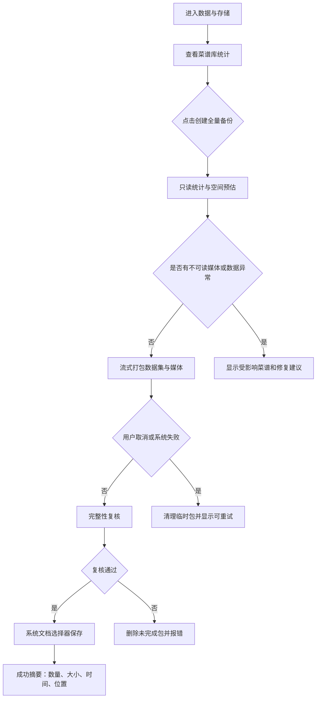
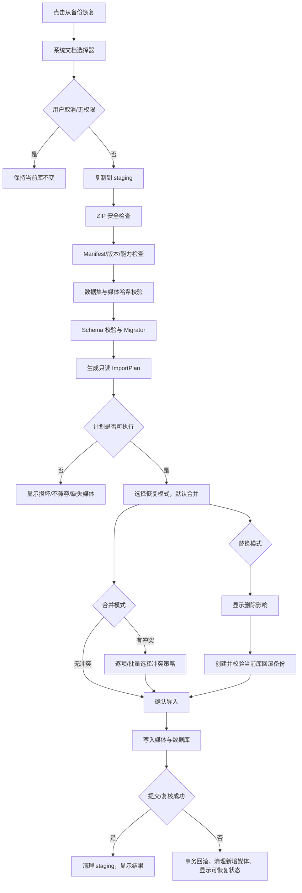

# 全量菜谱备份与恢复流程设计

> 版本：v0  
> 状态：待项目负责人走查  
> 日期：2026-08-06  
> 关联任务：`BACKUP-001`  
> 关联方案：`docs/architecture/RECIPE_BACKUP_RESTORE.md`  
> 关联故事：`US-014`

## 1. 入口与产品边界

入口建议：

```text
我的 → 数据与存储 → 菜谱备份与恢复
```

页面必须把两类能力分开：

- **内容导出/分享**：Markdown、PDF、图片，面向阅读和分享，可按菜谱选择；
- **菜谱库备份/恢复**：`*.airecipe-backup`，始终全量导出所有菜谱，面向迁移和恢复，不允许选择部分菜谱。

备份和恢复均为本地离线操作，不依赖登录、网络、LLM、OCR 或云同步。

## 2. 用户流程

### 2.1 创建全量备份



### 2.2 从备份恢复



## 3. 必须覆盖的界面状态

| 状态 | 需要展示的内容 | 可操作项 |
|---|---|---|
| 默认态 | 当前菜谱/分类/图片统计，说明备份始终全量 | 创建备份、选择恢复文件 |
| 空库 | `0` 道菜谱仍可创建合法空备份 | 创建空库备份、导入 |
| 统计中 | 正在统计菜谱、分类、媒体和空间 | 取消 |
| 打包中 | 当前阶段、记录数、媒体数、已用空间 | 取消；取消后清理临时包 |
| 导出成功 | 文件名、大小、时间、菜谱/分类/图片数量 | 分享文件、再次备份、返回 |
| 导出失败 | 稳定中文错误、受影响菜谱或空间建议 | 重试、返回 |
| 选择文件 | 文件类型和用户取消说明 | 选择、取消 |
| 读取中 | 正在检查包安全和 Manifest | 取消 |
| 预检成功 | 新增/跳过/可能重复/冲突/媒体/空间统计 | 默认合并；可切换高级替换 |
| 有冲突 | 当前值与备份值摘要，冲突数量；不得静默覆盖 | 保留当前、使用备份、保留两份、应用全部 |
| 有可选数据跳过 | 数据集名称、原因、可能损失 | 返回、确认继续 |
| 导入中 | 读取、媒体、数据库、复核阶段和进度 | 取消；进入提交点后说明无法立即撤销 |
| 导入成功 | 新增/跳过/冲突解决/媒体复用/回滚备份状态 | 查看菜谱库、返回 |
| 导入失败 | 已回滚/未改变当前库的明确结论 | 查看原因、重试、返回 |
| 损坏包 | 哈希不匹配、非法结构或安全限制 | 重新选择文件 |
| 未来版本 | 支持/不支持的功能和版本 | 取消或在可选数据确认后继续 |
| 权限拒绝 | 文档访问被拒绝，不泄露绝对路径 | 重新选择、返回 |
| 空间不足 | 需要空间、可用空间和释放建议 | 释放空间后重试、返回 |
| 离线 | 明确“备份恢复不需要网络” | 正常继续 |
| 游客态 | 本地备份可用，云同步不可用 | 正常继续 |
| 登录态 | 本地备份与云同步分开说明 | 正常继续 |
| 超大库 | 大小、耗时预估和后台不可保证说明 | 开始、取消 |

## 4. 关键交互规则

1. 创建备份按钮文案使用“创建全量备份”，不提供菜谱勾选框。
2. 恢复文件选中后先进入预检页；未完成预检不得显示“立即导入”。
3. 合并是默认模式；替换必须放在“高级恢复”下并二次确认。
4. 冲突永远不自动覆盖；“两者都保留”明确展示将生成备份副本。
5. 导入成功前，当前菜谱库不可被半成品替换。
6. 任何失败都明确显示“当前库未改变”或“已从回滚备份恢复”。
7. 用户取消文档选择器不显示错误，不产生导入任务。
8. 备份文件包含备注和图片，成功后提示用户不要公开分享。
9. 页面不能显示数据库表名、设备绝对路径、内部 ID 或堆栈。
10. 进度信息要区分“正在读取/校验/写媒体/写数据库/复核”，不可只显示无意义的旋转进度条。

## 5. 文案建议

- 全量说明：`会备份本机全部菜谱：正式、草稿、归档和回收站内容，以及分类和图片。不能只选择部分菜谱。`
- 合并说明：`把备份内容加入当前菜谱库，不会自动覆盖已有菜谱。`
- 替换说明：`用备份中的菜谱库替换当前菜谱库。开始前会自动创建回滚备份。`
- 冲突说明：`发现同一菜谱在当前库和备份中都有不同版本，请选择保留方式。`
- 成功说明：`导入已完成，当前菜谱库未包含备份范围之外的设置或账号凭证。`
- 回滚说明：`导入未完成，已恢复原菜谱库，当前数据没有被半成品覆盖。`
- 隐私提示：`备份文件包含菜谱文字、备注和图片，请保存到可信位置。`

## 6. 设计评审清单

### 默认、空、完成

- [ ] 默认页面明确“全量”而不是“选择导出”。
- [ ] 空库可创建合法备份，统计为 0。
- [ ] 成功页包含文件名、大小、时间和数量。

### 加载、错误、弱网、权限

- [ ] 统计、打包、读取、预检、导入各阶段有独立加载态。
- [ ] 用户取消、文档权限拒绝、文件不存在、文件损坏和空间不足均有可操作错误态。
- [ ] 离线时页面不误导用户需要联网。

### 冲突、未来版本、回滚

- [ ] 预检能区分新增、相同、可能重复、冲突和不可导入。
- [ ] 替换模式展示删除影响并要求回滚备份成功。
- [ ] 未来可选数据集被跳过时有明确提示；必需能力未知时阻止继续。
- [ ] 导入失败后能证明当前库未被破坏。

### 游客、登录、极限规模

- [ ] 游客/登录页面行为一致，只对云同步能力做说明差异。
- [ ] 超长菜名、大量食材、长步骤和大量图片不会破坏统计、预检和结果页布局。
- [ ] Android/iOS 文档选择器入口和返回路径可理解。
