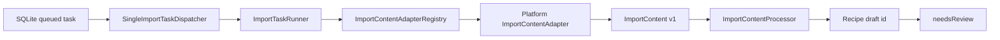

# 导入内容 Adapter 与调度内核

> 任务：`IMPORT-002`  
> 状态：v1 已实现并通过自动化验收  
> 实现位置：`code/apps/mobile/lib/domain/importing/`、`code/apps/mobile/lib/application/importing/`

## 1. 目标

在不绑定具体平台 HTTP 实现、OCR、ASR 或 LLM 供应商的前提下，建立稳定的导入后端内核：

1. 按来源平台选择内容 Adapter。
2. 将平台公开内容统一为可版本化的 `ImportContent`。
3. 将统一内容交给后续 OCR、ASR、LLM Processor。
4. 驱动持久化导入任务进入待确认状态。
5. 支持取消、稳定错误映射、有限重试和单执行器串行调度。

## 2. 模块边界



- Domain 定义统一内容、Adapter 契约、取消令牌和稳定错误类型。
- Application 负责任务编排、阶段推进、错误映射、重试计划和批次串行执行。
- Data 层只负责持久化任务，不感知平台抓取细节。
- 真实平台网络获取在 `IMPORT-003` 实现。
- OCR、ASR、LLM 处理器在后续任务中实现，不反向污染 Adapter。

## 3. 统一内容模型

`ImportContent` v1 包含：

- 原始 URL、规范化 URL、最终解析 URL和来源平台。
- 内容类型：文章、图集、视频、混合或未知。
- 可空标题、描述、作者和发布时间。
- 有序文本片段：标题、描述、正文、字幕、替代文本、元数据。
- 有序媒体引用：图片、视频或音频；支持远程 URL 或本地资产 ID。
- 警告集合：缺标题、缺文本、缺媒体、部分内容、需要 OCR、需要 ASR、发生重定向。
- UTC 抓取时间和固定 Schema 版本。

稳定 JSON 契约见：`docs/api/import-content.schema.json`。

关键不变量：

- URL 必须为 HTTP(S)。
- 文本不能为空字符串，顺序不能为负数。
- 媒体至少具有 `remoteUrl` 或 `localAssetId`。
- 宽高必须大于 0，时长和顺序不能为负数。
- 一份内容必须至少包含文本或媒体。
- 文本与媒体按 `order` 排序，警告自动去重。

## 4. Adapter 契约

每个平台实现一个 `ImportContentAdapter`：

```dart
abstract interface class ImportContentAdapter {
  ImportSourcePlatform get platform;

  Future<ImportContent> fetch(
    ImportSourceLink source, {
    ImportCancellationToken? cancellationToken,
  });
}
```

注册表按平台选择 Adapter，并拒绝同一平台重复注册。未注册平台返回稳定的 `unsupportedPlatform` 错误。

Adapter 稳定错误类型：

- `unsupportedPlatform`
- `contentUnavailable`
- `authorizationRequired`
- `networkUnavailable`
- `timeout`
- `invalidPayload`
- `cancelled`
- `unknown`

Adapter 不得持久化 Cookie、Authorization Header、API Key、原始 HTML 或完整敏感响应。

## 5. Processor 契约

`ImportContentProcessor` 接收统一内容，负责未来的 OCR、ASR、文本融合和 LLM 结构化生成。Processor 只能报告：

- `extracting`
- `ocr`
- `transcribing`
- `generating`

成功时返回草稿菜谱 ID。稳定失败通过 `ImportPipelineException` 返回现有 `ImportTaskErrorCode`，未知异常由 Runner 脱敏为通用错误。

## 6. Runner 行为

`ImportTaskRunner`：

1. 只接受 `queued` 任务。
2. 开始后进入 `running/fetching`。
3. Adapter 成功后进入 `extracting`，最低进度为 0.25。
4. 接受 Processor 的合法阶段进度回调。
5. 确保完成前进入 `generating` 且进度至少为 0.9。
6. 生成草稿后进入 `needsReview` 并保存 `resultRecipeId`。
7. 取消时进入 `cancelled`。
8. Adapter 与 Processor 错误映射到稳定任务错误码。
9. 未知异常不保存原始异常正文，避免敏感信息进入数据库。

默认重试退避：首次 30 秒，随后指数翻倍，最大 15 分钟；`maxAttempts` 仍由任务领域规则限制。

## 7. Dispatcher 行为

`SingleImportTaskDispatcher` 是当前进程内的单执行器：

- 同一实例只允许一个批次运行。
- 读取 `queued` 任务，按 `createdAt`、`id` 升序执行。
- 单任务失败不会阻断后续任务。
- 支持批次 `limit`。
- 批次取消会取消当前任务并停止领取新任务。
- 返回不可变的批次结果报告。

当前不提供跨进程租约、多实例抢占、后台 Isolate 或服务端队列。引入这些能力前必须新增任务并补充并发契约。

## 8. 安全与合规边界

- 只处理用户主动提供的链接或媒体。
- 不绕过登录、验证码、签名、访问控制或平台反爬机制。
- 公开内容不可获取时，稳定映射为 `authorizationRequired` 或 `contentUnavailable`，交给产品降级流程。
- API Key 仍只允许进入 Keychain/Keystore，不进入导入任务和统一内容。
- 远程媒体引用在后续获取前必须实施重定向、响应体大小、内容类型和超时限制。

## 9. 验证

验收记录：`tests/acceptance/IMPORT-002-content-adapter-dispatcher-2026-07-28.md`。

已覆盖：

- 内容规范化和不变量。
- Adapter 注册、缺失平台和重复注册。
- Runner 成功、失败、取消、错误映射、消息脱敏和重试计划。
- Dispatcher 串行顺序、失败后继续、并发批次拒绝、取消和数量限制。
- 全量 Flutter 静态分析与 58 项自动化测试。
