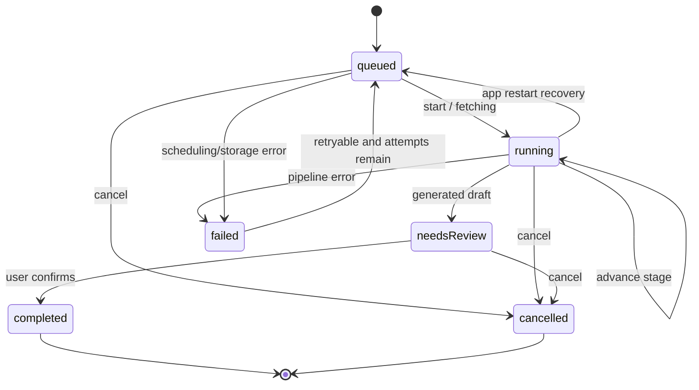

# 链接导入任务流水线

> 任务：`IMPORT-001`  
> 状态：v1 已实现并通过自动化验收  
> 契约版本：v1  
> 最后更新：2026-07-28

## 1. 目标

在接入小红书、抖音真实解析器、OCR、ASR 和 LLM 之前，先建立一个可以脱离 UI 独立运行、可以持久化、可以恢复的导入任务内核。系统分享、手动粘贴和后续云端同步都只能创建或驱动导入任务，不能直接操作 Provider 或数据库。

## 2. 本轮范围

本轮实现：

- 小红书、抖音 URL 校验、平台识别与基础规范化。
- 导入任务生命周期和处理阶段状态机。
- 失败、取消、重试和应用重启恢复规则。
- SQLite `import_tasks` 持久化及 Schema v1 → v2 迁移。
- Application 用例，隔离 UI、SQLite 和未来 Provider。
- 状态机、Repository、用例与数据库迁移自动化测试。

本轮不实现：

- 小红书或抖音真实页面抓取、登录态绕过或反爬处理。
- OCR、ASR、LLM 的真实调用和任务调度器。
- 后台执行、系统通知、系统分享入口和 UI。
- API Key、Provider 请求正文、页面 Cookie 或原始敏感响应的持久化。

## 3. 分层

```text
系统分享 / 粘贴链接 / 后台恢复
                ↓
         Application 用例
                ↓
      ImportTask 领域状态机
                ↓
      ImportTaskRepository
                ↓
       SQLite import_tasks
```

- Domain 是纯 Dart，只包含模型、约束和状态转换。
- Application 负责读取任务、执行状态转换并持久化。
- Data 负责 SQLite 映射，不决定业务状态。
- 后续 Fetch/OCR/ASR/LLM Adapter 只向 Application 返回结果或项目错误，不直接改表。

## 4. 生命周期与处理阶段

生命周期 `ImportTaskStatus`：

| 状态 | 含义 |
|---|---|
| `queued` | 已持久化，等待调度 |
| `running` | 某个处理阶段正在运行 |
| `needsReview` | 已生成结构化菜谱草稿，等待用户确认 |
| `completed` | 用户确认并完成导入 |
| `failed` | 失败；是否可重试由 `retryable` 决定 |
| `cancelled` | 用户取消，终止后续自动执行 |

处理阶段 `ImportTaskStage`：

```text
queued → fetching → extracting → ocr / transcribing → generating
       → review → completed
```

失败和取消使用 `failed`、`cancelled` 阶段。OCR 与 ASR 可以按媒体类型跳过，因此运行阶段只要求单调向前，不要求每一阶段都经过。



## 5. 核心不变量

1. `progress` 必须在 `0..1`。
2. `attempt` 从 1 开始，且不能超过 `maxAttempts`。
3. `updatedAt >= createdAt`；其他时间不能早于 `createdAt`。
4. 每次真实状态变化必须让 `localVersion` 增加 1。
5. `running` 只能使用处理阶段，阶段和进度不能倒退。
6. `needsReview` 与 `completed` 必须关联 `resultRecipeId`。
7. `completed` 和 `cancelled` 是终态。
8. `failed` 必须包含错误码；只有 `retryable == true` 且仍有剩余尝试次数时可以重试。
9. 重试会增加 `attempt`、清理旧错误和完成时间，并回到 `queued`。
10. 取消是幂等操作；重复取消不产生新版本。
11. 应用重启时不得假装继续旧进程：遗留 `running` 任务重新排队；达到最大尝试次数的任务转为不可自动重试的失败。
12. 任务表不保存 API Key、Cookie、完整 Provider 请求或原始敏感响应。

## 6. 错误码

首版项目错误码：

- `invalidUrl`
- `unsupportedPlatform`
- `contentUnavailable`
- `authorizationRequired`
- `fetchFailed`
- `extractionFailed`
- `ocrFailed`
- `asrFailed`
- `llmFailed`
- `schemaInvalid`
- `networkUnavailable`
- `timeout`
- `interrupted`
- `cancelled`
- `storageFailure`
- `unknown`

错误码是稳定契约；供应商异常文本只能作为经过清理的 `errorMessage`，不能替代错误码。

## 7. Application 用例

- `CreateImportTask`：校验 URL、识别平台、规范化并持久化排队任务。
- `StartImportTask`：从 `queued` 进入 `running/fetching`。
- `AdvanceImportTask`：单调推进阶段和进度。
- `MarkImportTaskNeedsReview`：关联结构化菜谱草稿。
- `CompleteImportTask`：确认草稿并结束任务。
- `FailImportTask`：写入统一错误和重试信息。
- `CancelImportTask`：幂等取消。
- `RetryImportTask`：校验重试条件并重新排队。
- `RecoverInterruptedImportTasks`：扫描可恢复任务并重置旧运行状态。

所有按 ID 操作在任务不存在时抛出统一的 `ImportTaskNotFoundException`。状态不允许时抛出 `ImportTaskTransitionException`。

## 8. SQLite v2

Schema v2 新增 `import_tasks`：

- 任务身份与来源：`id`、`source_url`、`normalized_url`、`source_platform`。
- 生命周期：`status`、`stage`、`progress`。
- 重试：`attempt`、`max_attempts`、`retryable`、`next_retry_at`。
- 错误：`error_code`、`error_message`。
- 结果：`result_recipe_id` 是跨聚合逻辑引用，首版不使用 SQLite 外键；一致性与菜谱删除语义由 Application 用例维护，避免数据库级 `SET NULL` 破坏 `needsReview/completed` 状态不变量。
- 时间与同步：`created_at`、`updated_at`、`started_at`、`completed_at`、`cancelled_at`、`local_version`、`deleted_at`。

迁移要求：

- v1 数据库升级到 v2 时只新增表和索引。
- 旧菜谱、食材、步骤、分类和关系必须保留。
- 不允许通过删库重建代替迁移。
- 新安装直接创建完整 v2 Schema。

## 9. 后续接入点

状态机稳定后按以下顺序接入：

1. Android/iOS 系统分享 URL → `CreateImportTask`。
2. 调度器获取 `queued` 任务 → `StartImportTask`。
3. 平台 Adapter、OCR、ASR、LLM 每完成一步 → `AdvanceImportTask`。
4. 生成结构化菜谱草稿 → `MarkImportTaskNeedsReview`。
5. 前端确认页编辑并保存 → `CompleteImportTask`。
6. 应用启动 → `RecoverInterruptedImportTasks`。

## 10. 验证结果

- Domain、Application、SQLite Repository 和 v1 → v2 迁移测试已通过。
- 取消待确认任务会清理草稿逻辑引用，重复取消保持幂等。
- `flutter analyze --no-pub` 无问题。
- `flutter test --no-pub` 共 41 项测试全部通过。
- 验收记录：`tests/acceptance/IMPORT-001-import-task-state-machine-2026-07-28.md`。