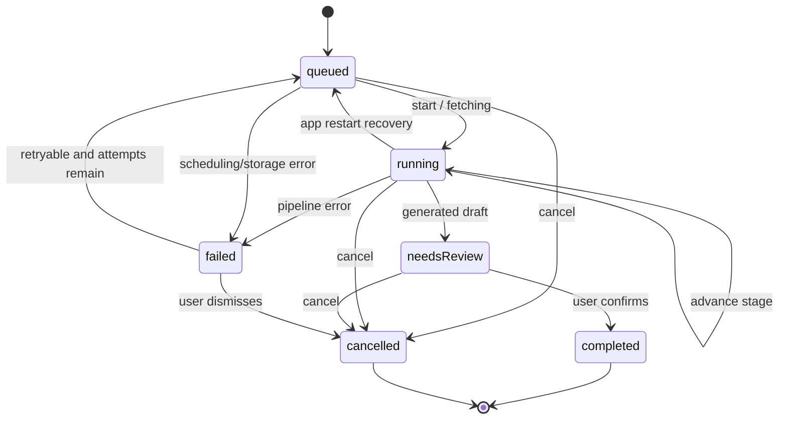

# 链接导入任务流水线

> 任务：`IMPORT-001`
> 状态：v1 已实现；`BUG-002` 并发取消与 `BUG-005` 失败任务主动结束进入验证
> 契约版本：v1.2
> 最后更新：2026-08-02

## 1. 目标

在接入小红书、抖音真实解析器、OCR、ASR 和 LLM 之前，先建立一个可以脱离 UI 独立运行、可以持久化、可以恢复的导入任务内核。系统分享、手动粘贴和后续云端同步都只能创建或驱动导入任务，不能直接操作 Provider 或数据库。

## 2. 本轮范围

本轮实现：

- 小红书、抖音 URL 校验、平台识别与基础规范化。
- 导入任务生命周期和处理阶段状态机。
- 失败、取消、重试和应用重启恢复规则。
- SQLite `import_tasks` 持久化及 Schema v1 → v2 迁移。
- Application 用例，隔离 UI、SQLite 和未来 Provider。
- 状态机、Repository、用例与数据库迁移自动化测试。
- `localVersion` Compare-and-Set、取消优先级和迟到草稿补偿清理。

本轮不实现：

- 小红书或抖音真实页面抓取、登录态绕过或反爬处理。
- OCR、ASR、LLM 的真实调用和任务调度器。
- 后台执行、系统通知、系统分享入口和 UI。
- API Key、Provider 请求正文、页面 Cookie 或原始敏感响应的持久化。

## 3. 分层

```text
系统分享 / 粘贴链接 / 后台恢复
                ↓
         Application 用例
                ↓
      ImportTask 领域状态机
                ↓
      ImportTaskRepository
                ↓
       SQLite import_tasks
```

- Domain 是纯 Dart，只包含模型、约束和状态转换。
- Application 负责读取任务、执行状态转换并持久化。
- Data 负责 SQLite 映射，不决定业务状态。
- 后续 Fetch/OCR/ASR/LLM Adapter 只向 Application 返回结果或项目错误，不直接改表。

## 4. 生命周期与处理阶段

生命周期 `ImportTaskStatus`：

| 状态 | 含义 |
|---|---|
| `queued` | 已持久化，等待调度 |
| `running` | 某个处理阶段正在运行 |
| `needsReview` | 已生成结构化菜谱草稿，等待用户确认 |
| `completed` | 用户确认并完成导入 |
| `failed` | 失败；是否可重试由 `retryable` 决定；用户处理前计入未完成 |
| `cancelled` | 用户取消，终止后续自动执行 |

处理阶段 `ImportTaskStage`：

```text
queued → fetching → extracting → ocr / transcribing → generating
       → review → completed
```

失败和取消使用 `failed`、`cancelled` 阶段。OCR 与 ASR 可以按媒体类型跳过，因此运行阶段只要求单调向前，不要求每一阶段都经过。



## 5. 核心不变量

1. `progress` 必须在 `0..1`。
2. `attempt` 从 1 开始，且不能超过 `maxAttempts`。
3. `updatedAt >= createdAt`；其他时间不能早于 `createdAt`。
4. 每次真实状态变化必须让 `localVersion` 增加 1。
5. `running` 只能使用处理阶段，阶段和进度不能倒退。
6. `needsReview` 与 `completed` 必须关联 `resultRecipeId`。
7. `completed` 和 `cancelled` 是终态。
8. `failed` 必须包含错误码；只有 `retryable == true` 且仍有剩余尝试次数时可以重试。
9. 重试会增加 `attempt`、清理旧错误和完成时间，并回到 `queued`。
10. 取消是幂等操作；重复取消不产生新版本。
11. 应用重启时不得假装继续旧进程：遗留 `running` 任务重新排队；达到最大尝试次数的任务转为不可自动重试的失败。
12. 任务表不保存 API Key、Cookie、完整 Provider 请求或原始敏感响应。
13. 已存在任务的每次持久化更新必须携带读取时的 `expectedLocalVersion`；SQLite 只能在 `id` 和 `local_version` 同时匹配时更新。
14. 旧快照写入必须返回 `ImportTaskWriteConflictException`，调用方重新读取后决定结果，不得覆盖新版本。
15. 持久化 `cancelled` 的优先级高于后到的 Provider 成功、Schema 错误、网络错误或未知异常。
16. 若迟到成功已生成草稿而取消先赢得任务写入，Runner 必须补偿删除该草稿；删除必须幂等，并只作用于 ID、来源匹配且仍为 `draft` 的菜谱。
17. `failed` 在用户重试、采用人工降级或主动结束前属于未完成；不得通过查询过滤隐藏。
18. 用户主动结束失败任务时复用原任务执行 `failed → cancelled`，保留失败记录；`cancelled` 不计入未完成，数据库重开后仍保持终态。

## 6. 错误码

首版项目错误码：

- `invalidUrl`
- `unsupportedPlatform`
- `contentUnavailable`
- `authorizationRequired`
- `fetchFailed`
- `extractionFailed`
- `ocrFailed`
- `asrFailed`
- `llmFailed`
- `schemaInvalid`
- `networkUnavailable`
- `timeout`
- `interrupted`
- `cancelled`
- `storageFailure`
- `unknown`

错误码是稳定契约；供应商异常文本只能作为经过清理的 `errorMessage`，不能替代错误码。

### 6.1 错误展示优先级

导入进度页的错误事实源按以下顺序处理：

1. 任务已持久化为 `failed` 且存在非空 `errorMessage`：只显示任务错误和对应降级/重试入口。
2. 任务没有持久化错误，但 Facade 调用失败：显示经过 Facade 映射的页面级稳定错误。
3. 不得让页面宿主刷新、能力读取或其他调用栈异常覆盖已经持久化的任务状态，也不得同时叠加相互冲突的两组错误。

如果页面仍显示 `queued/0%`，但 `runImportTask()` 已抛出异常，优先检查能力校验、会话读取和 Runner 创建等任务启动前边界；在任务进入 `fetching` 前不能把故障归因于公开内容 Adapter、Parser 或 LLM。

## 7. Application 用例

- `CreateImportTask`：校验 URL、识别平台、规范化并持久化排队任务。
- `StartImportTask`：从 `queued` 进入 `running/fetching`。
- `AdvanceImportTask`：单调推进阶段和进度。
- `MarkImportTaskNeedsReview`：关联结构化菜谱草稿。
- `CompleteImportTask`：确认草稿并结束任务。
- `FailImportTask`：写入统一错误和重试信息。
- `CancelImportTask`：支持 `queued`/`running` 取消、`needsReview` 放弃和 `failed` 主动结束；使用版本条件幂等写入，冲突时重新读取，已取消则直接返回，其他状态按最新快照重试。
- `RetryImportTask`：校验重试条件并重新排队。
- `RecoverInterruptedImportTasks`：扫描可恢复任务并重置旧运行状态。

所有按 ID 操作在任务不存在时抛出统一的 `ImportTaskNotFoundException`。状态不允许时抛出 `ImportTaskTransitionException`。

## 8. 并发写入与取消优先级

`ImportTaskRepository.upsertTask(task, expectedLocalVersion)` 的语义如下：

- 新建任务不传期望版本；已存在任务必须传入读取时的版本。
- SQLite 使用条件 `UPDATE ... WHERE id = ? AND local_version = ?`；影响行数为 0 时抛出明确写冲突。
- Runner 在提交 `needsReview` 和任意失败状态前重新读取任务。若最新状态为 `cancelled`，统一返回取消结果，不再写入迟到状态。
- 处理器已经保存草稿但 `needsReview` CAS 失败时，Runner 先读取最新任务；取消获胜则调用安全草稿丢弃器。
- 安全丢弃器只删除与结果 ID、导入来源匹配且仍为草稿的数据。正式菜谱、来源不匹配或已经被其他流程接管的数据保持不变。

交互层必须始终为 `queued` 或 `running` 任务保留取消入口。AI 请求是否正在执行（例如页面 `_running`）不得禁用“取消解析”；取消入口只允许在取消状态正在提交时短暂禁用，以防重复请求，并应给出“正在取消…”反馈。

`failed` 页面必须保留真实错误与人工降级入口；可重试失败继续提供重试。所有失败任务额外提供“结束此导入”，提交期间显示“正在结束…”，并通过同一个 `CancelImportTask` 将原任务持久化为 `cancelled`。该动作不删除失败记录，不创建替代任务，也不能通过未完成查询静默过滤 `failed`。结束成功后首页未完成数量减少，强制停止并重启后不得重新恢复该任务。

该机制解决两个执行分支从同一旧快照提交时的“最后写入者获胜”问题。内存取消 Token 仍用于尽快终止 I/O，但持久化状态和 CAS 才是并发事实源。

## 9. SQLite v2

Schema v2 新增 `import_tasks`：

- 任务身份与来源：`id`、`source_url`、`normalized_url`、`source_platform`。
- 生命周期：`status`、`stage`、`progress`。
- 重试：`attempt`、`max_attempts`、`retryable`、`next_retry_at`。
- 错误：`error_code`、`error_message`。
- 结果：`result_recipe_id` 是跨聚合逻辑引用，首版不使用 SQLite 外键；一致性与菜谱删除语义由 Application 用例维护，避免数据库级 `SET NULL` 破坏 `needsReview/completed` 状态不变量。
- 时间与同步：`created_at`、`updated_at`、`started_at`、`completed_at`、`cancelled_at`、`local_version`、`deleted_at`。

迁移要求：

- v1 数据库升级到 v2 时只新增表和索引。
- 旧菜谱、食材、步骤、分类和关系必须保留。
- 不允许通过删库重建代替迁移。
- 新安装直接创建完整 v2 Schema。

## 10. 后续接入点

状态机稳定后按以下顺序接入：

1. Android/iOS 系统分享 URL → `CreateImportTask`。
2. 调度器获取 `queued` 任务 → `StartImportTask`。
3. 平台 Adapter、OCR、ASR、LLM 每完成一步 → `AdvanceImportTask`。
4. 生成结构化菜谱草稿 → `MarkImportTaskNeedsReview`。
5. 前端确认页编辑并保存 → `CompleteImportTask`。
6. 应用启动 → `RecoverInterruptedImportTasks`。

## 11. 验证结果

- Domain、Application、SQLite Repository、Facade 和数据库迁移回归通过。
- 新增 SQLite 真实文件竞态验证：取消优先于后到 Schema 错误；取消优先于后到成功并清理草稿；数据库重开后仍为取消且无孤立草稿。
- ImportTask 相关定向测试 53 项全部通过。
- `flutter analyze --no-pub` 无问题。
- `flutter test --no-pub --concurrency=4` 共 475 项全部通过。
- Android 真实 OpenAI-compatible 请求已到达 LLM 阶段；运行态取消入口的源码修复已完成，不再由 AI 请求的 `_running` 状态禁用。按项目负责人要求，本轮未运行新的分析、测试或 Android 构建，真实点击、迟到响应和重启持久化仍待人工验收，不以既有自动化结果替代。
- 验收记录：`tests/acceptance/BUG-002-import-cancellation-race-2026-08-01.md`。
