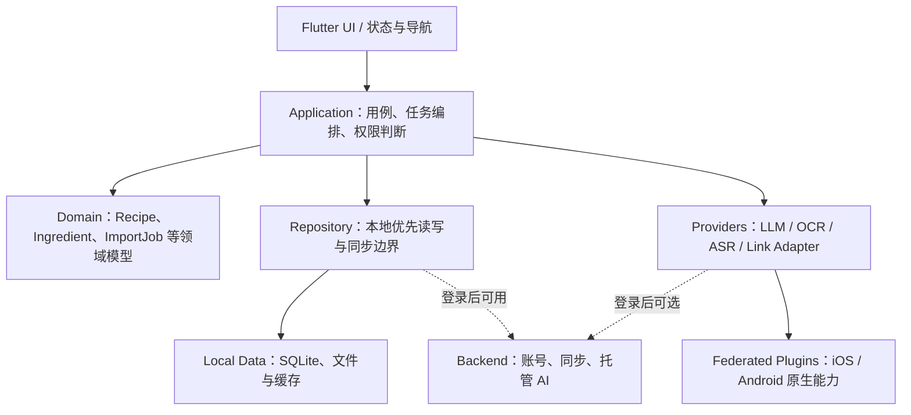

# 移动端架构基线（Flutter）

- 状态：已生效，后续通过 `SPK-001` 做关键能力实测
- 日期：2026-07-27
- 关联决策：`ADR-0008`
- 关联任务：`SPK-001`、`ARCH-001`

## 1. 目标与边界

首版客户端统一使用 Flutter，优先交付 iOS 和 Android。应用必须在没有账号、没有云服务、没有网络时仍能完成本地菜谱的创建、浏览、编辑、分类和烹饪查看。

本架构基线只确定长期模块边界，不代表 Flutter 真机能力已经验收。数据库、后台任务、分享扩展、通知、安全存储和原生 OCR 桥接仍须在 `SPK-001` 中建立最小工程并实测。

## 2. 核心原则

1. **Local-first**：UI 默认读取本地数据库，云端只做同步和托管能力。
2. **游客可用**：游客可以使用全部本地核心功能以及自行配置的本地/自有 AI Provider。
3. **Provider 解耦**：LLM、OCR、ASR、链接解析均通过接口调用，页面不得直接依赖供应商 SDK。
4. **密钥隔离**：API Key、访问令牌和证书只进入 iOS Keychain / Android Keystore 封装的安全存储。
5. **可降级**：链接解析失败时允许用户改用粘贴文本、选择图片、OCR 或手工录入。
6. **可追踪**：AI 结果保留来源证据、Provider、模型、Schema 版本和置信度，保存前由用户确认。
7. **原生能力最小化**：优先使用 Dart 实现业务；只有系统分享、后台任务、安全存储、通知、OCR 推理等必要能力进入原生插件层。

## 3. 逻辑分层



### 3.1 Presentation

负责页面、组件、导航、表单状态、加载/错误/空状态和无障碍，不直接访问 SQLite、HTTP 客户端或供应商 SDK。

### 3.2 Application

负责用户故事级用例，例如新建菜谱、链接导入任务、AI 流水线编排、游客/登录权限、任务重试取消与恢复。

### 3.3 Domain

包含与 Flutter UI、数据库和网络无关的纯 Dart 模型及规则。领域模型使用稳定 UUID，并为同步准备版本号、更新时间和软删除字段。

### 3.4 Data / Repository

Repository 对上提供统一接口；本地实现是默认实现。登录后的同步层只能增量同步本地变更，不能让页面绕过本地库直接依赖云端响应。

### 3.5 Provider / Adapter

- `LlmProvider`：统一接收 API 地址、Key 和模型，由 OpenAI-compatible、Gemini 等协议 Adapter 构造请求；托管 AI 也复用同一领域接口。
- `OcrProvider`：本地 PaddleOCR 插件或云端 OCR。
- `AsrProvider`：本地或云端语音识别。
- `ContentSourceAdapter`：小红书、抖音及未来平台。

Provider 输出统一领域 DTO 和错误码，供应商响应不得传播到页面层。

## 4. 计划代码结构

```text
code/apps/mobile/
├── lib/
│   ├── app/                  启动、路由、主题、依赖装配
│   ├── features/             auth/library/editor/detail/import/cooking/settings
│   ├── domain/               领域模型与接口
│   ├── data/                 Repository、本地库、同步实现
│   ├── providers/            LLM/OCR/ASR/链接适配器
│   └── platform/             Flutter 插件封装与平台权限
├── packages/
│   └── local_ocr/            Federated OCR plugin（后续创建）
├── android/
├── ios/
└── test/
```

共享 Schema 若需同时被服务端使用，应放到 `code/packages/shared/`，不要复制多份独立定义。

## 5. 游客与登录能力边界

| 能力 | 游客 | 登录用户 |
|---|---|---|
| 本地菜谱、分类、搜索、编辑 | 可用 | 可用 |
| 本地备份与恢复 | 可用 | 可用 |
| 本地 OCR 插件 | 可用 | 可用 |
| 用户自配本地/自有 LLM API | 可用 | 可用 |
| 平台托管 OCR/LLM/ASR | 不可用 | 按配额可用 |
| 云同步和多设备恢复 | 不可用 | 可用 |
| API Key 云同步 | 默认禁止 | 默认禁止 |

登录是能力升级，不应创建另一套本地数据模型。游客登录后执行身份绑定和增量上传，而不是把本地库替换成云端库。

## 6. 平台集成边界

首版需要验证：系统分享入口、后台任务、本地通知、安全存储、本地网络权限，以及通过 federated plugin 封装 ONNX Runtime Mobile 的 OCR 推理。

任何插件都必须在 Dart 层有可替换接口和 Fake 实现，保证单元测试不依赖真机。

## 7. 首个工程骨架验收

1. Android 真机或模拟器启动 Flutter 应用。
2. iOS 构建配置在 macOS 环境完成；Windows 不能替代 iOS 真机验收。
3. 写入并读取一条本地 Recipe。
4. Keychain/Keystore 封装可保存和删除测试密钥。
5. 分享入口能接收至少一种 URL。
6. Provider Fake 能生成结构化菜谱并驱动确认页面。
7. 所有验证结果写入对应 Spike 和验收记录。

## 8. 参考资料

- Flutter Platform Channels：<https://docs.flutter.dev/platform-integration/platform-channels>
