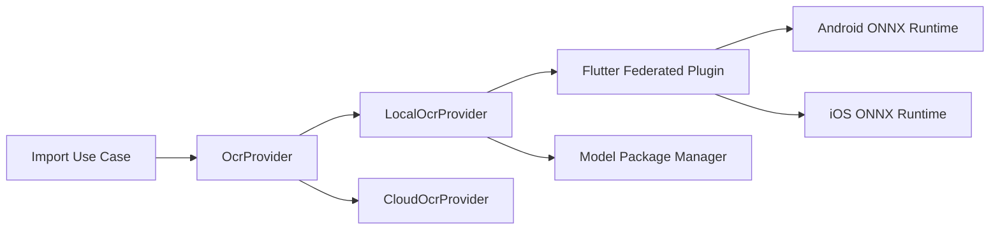

# OCR Provider 与本地插件方案

- 状态：首选方案已确定，性能与真机兼容性待 `SPK-002` 验证
- 日期：2026-07-27
- 关联决策：`ADR-0009`
- 关联任务：`SPK-002`、`OCR-001`

## 1. 首选推荐

首版本地 OCR 推荐采用：

> **PaddleOCR PP-OCRv5 mobile 模型 + ONNX Runtime Mobile + 自定义 Flutter federated plugin**

原因：PaddleOCR 更贴合中文、长文本、食材表和复杂截图；PP-OCRv5 提供端侧 mobile 模型；ONNX Runtime Mobile 同时支持 Android/iOS；模型可作为独立资源包按需下载、校验、升级、删除和回滚；PaddleOCR 采用 Apache-2.0 许可。

这是架构选择，不等于性能验证完成。若 `SPK-002` 证明 iOS 落地成本、低端机内存或包体不可接受，MVP 降级候选为系统/ML Kit OCR，但页面层不能写死降级引擎。

## 2. Provider 架构



建议 Dart 接口：

```dart
abstract interface class OcrProvider {
  String get id;
  Future<OcrResult> recognize(OcrRequest request);
  Future<OcrHealth> healthCheck();
  Future<void> cancel(String requestId);
}
```

统一结果至少包含完整文本、有序文本块、边界框、置信度、语言提示、引擎/模型/版本/耗时、输入资源 ID 和标准错误码。

## 3. 本地插件结构

```text
local_ocr/
├── local_ocr/                         Dart 公共 API
├── local_ocr_platform_interface/      平台接口与 Mock
├── local_ocr_android/                 Android ONNX Runtime 实现
└── local_ocr_ios/                     iOS ONNX Runtime 实现
```

禁止业务页面直接调用 MethodChannel；平台通道只存在于插件实现层。

## 4. 模型包与下载机制

模型不默认打进主安装包。每个模型包使用 Manifest 描述：

```json
{
  "id": "paddleocr-ppocrv5-zh-mobile",
  "version": "1.0.0",
  "engine": "onnxruntime",
  "platforms": ["android", "ios"],
  "files": [
    {"name": "det.onnx", "sha256": "...", "size": 0},
    {"name": "rec.onnx", "sha256": "...", "size": 0},
    {"name": "dict.txt", "sha256": "...", "size": 0}
  ],
  "minAppVersion": "0.1.0",
  "license": "Apache-2.0"
}
```

安装流程：获取受信任 Manifest → 检查设备与空间 → 下载临时文件 → SHA-256 校验 → 原子安装 → 健康检查 → 切换版本；失败回滚。首版只接受模型数据和词典，不允许插件下载任意脚本或动态库。

## 5. 识别流水线

```text
输入图片 → 方向修正 → 预处理 → 文本检测 → 裁剪/方向处理
→ 文本识别 → 阅读顺序重排 → OcrResult → LLM 菜谱结构化
```

OCR 只负责识别文字，不自行猜测菜名、用量或步骤关系。结构化推断交给 LLM，并在确认页显示低置信度和来源证据。

## 6. 隐私与安全

- 本地 OCR 默认不上传图片；云 OCR 执行前明确提示 Provider 和上传内容。
- 临时图片与中间裁剪在任务结束或取消后清理。
- 日志不写完整 OCR 文本和原图路径。
- 模型包执行哈希校验，下载域名使用白名单。
- 云 OCR Key 只存 Keychain/Keystore，不进入数据库、备份或同步。

## 7. SPK-002 必测矩阵

| 指标 | Android | iOS |
|---|---:|---:|
| 模型压缩后下载体积 | 待测 | 待测 |
| 首次模型加载耗时 | 待测 | 待测 |
| 单张 1080p 图片耗时 | 待测 | 待测 |
| 峰值内存 | 待测 | 待测 |
| 中文字符准确性 | 待测 | 待测 |
| 食材行顺序正确率 | 待测 | 待测 |
| 竖排/倾斜/低清晰度表现 | 待测 | 待测 |
| 取消、低内存和模型损坏处理 | 待测 | 待测 |

至少覆盖中低端 Android、主流 Android 和支持目标最低系统版本的 iPhone。

## 8. 参考资料

- PP-OCRv5：<https://www.paddleocr.ai/main/en/version3.x/algorithm/PP-OCRv5/PP-OCRv5.html>
- PaddleOCR：<https://github.com/PaddlePaddle/PaddleOCR>
- ONNX Runtime Mobile：<https://onnxruntime.ai/docs/get-started/with-mobile.html>
- ONNX Runtime 安装包：<https://onnxruntime.ai/docs/install/>
