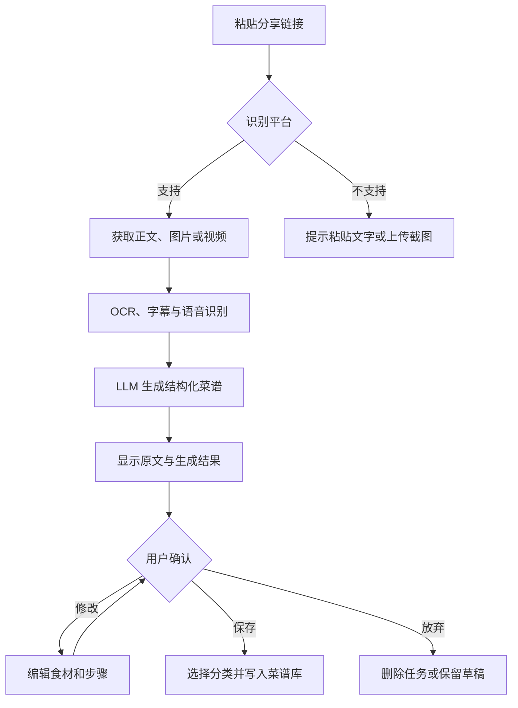
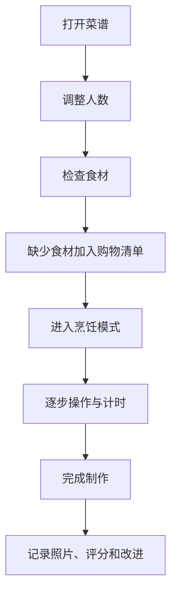
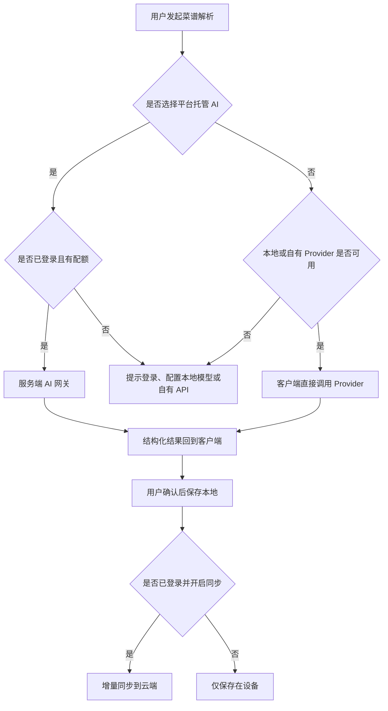

# AI 食谱应用产品需求文档（持续迭代版）

> 文档状态：草案  
> 当前版本：v0.4  
> 创建日期：2026-07-27  
> 产品定位：将小红书、抖音等平台中的菜谱内容快速转换为结构化、可编辑、可执行的个人食谱。

---

## 1. 产品概述

### 1.1 产品背景

用户经常在小红书、抖音等内容平台收藏菜谱，但这些内容通常存在以下问题：

- 菜谱分散在不同平台，难以统一管理。
- 视频内容较长，实际做菜时不方便反复拖动查看。
- 食材、用量、步骤隐藏在视频口播、字幕、图片或正文中。
- 原内容可能缺少明确用量、火候、时间或步骤顺序。
- 收藏内容可能失效、被删除或无法离线查看。

本应用通过导入内容链接，提取其中的文本、图片、字幕及语音信息，再利用 LLM 将内容整理为结构化食谱，帮助用户建立自己的数字菜谱库。

### 1.2 核心价值

1. **快速导入**：粘贴小红书或抖音链接，一键生成结构化食谱。
2. **统一管理**：将不同来源的菜谱归档到个人分类中。
3. **方便下厨**：食材、用量和步骤清晰展示，并提供烹饪模式。
4. **允许纠错**：AI 生成结果必须可编辑、可补充、可重新生成。
5. **持续沉淀**：收藏内容转化为真正属于用户的个人食谱资产。

### 1.3 目标用户

- 经常在小红书、抖音寻找菜谱的人。
- 喜欢做饭，但不愿整理视频或图文菜谱的人。
- 需要为家庭规划日常饮食的人。
- 健身、减脂、控糖或有饮食限制的人。
- 希望建立个人菜谱库、美食笔记或家庭菜谱的人。

---

## 2. 产品目标与边界

### 2.1 第一阶段目标

第一阶段重点验证以下闭环：

> 粘贴链接 → 获取内容 → AI 解析 → 用户确认 → 保存菜谱 → 下厨查看

### 2.2 已确认的产品决策

- 产品采用**移动端优先、跨平台开发**，首要支持 iOS 和 Android。
- 核心菜谱数据采用 **Local-first（本地优先）** 设计，不登录也能完整使用本地菜谱库。
- 软件同时提供登录模式和游客模式，不强制用户注册后才能使用。
- 登录用户可以使用云端同步、云端备份和平台托管的 AI/OCR 服务。
- 游客不能使用平台托管的 AI 服务，也不能将数据保存到平台云端。
- 游客可以配置本地 LLM API、自有第三方 LLM API、本地 OCR 插件或自有云 OCR API。
- 登录后可以将游客时期的本地菜谱、分类、购物清单和设置合并到账号。
- LLM、OCR 和后续 ASR 能力均采用供应商适配器设计，避免业务逻辑绑定单一平台。

### 2.3 平台范围

首版目标平台：

- iOS 手机和平板。
- Android 手机和平板。

后续可在复用业务层的基础上扩展：

- Web 管理端。
- Windows/macOS 桌面端。
- 微信小程序轻量入口。

跨平台不代表所有平台完全复用 UI；核心数据模型、业务逻辑、网络层和 AI/OCR 适配层应尽可能共享，各平台保留必要的系统能力适配。

---

## 3. 产品设计原则

1. **先生成，再确认**：AI 结果不能未经用户确认直接覆盖原数据。
2. **来源可追溯**：每份导入菜谱保留原始链接和来源平台。
3. **结构化优先**：食材、用量、步骤、时间、火候应使用独立字段。
4. **手动编辑永远可用**：链接解析失败时，用户仍可粘贴文字、上传截图或手动创建。
5. **适合厨房场景**：操作按钮大、步骤清晰、避免频繁返回和滚动。
6. **降低 AI 幻觉风险**：无法从原内容确认的信息应明确标记为“AI 推测”或“原内容未说明”。
7. **移动端优先**：主要使用场景是手机收藏和厨房查看。
8. **本地优先**：即使未登录或断网，用户仍可查看、创建和编辑本地菜谱。
9. **能力可替换**：LLM、OCR、ASR 和链接解析通过统一接口接入，不锁定单一服务商。
10. **隐私可选择**：用户可以明确决定图片、视频和菜谱文本是否允许发送到云端处理。

---

## 4. 信息架构

建议底部主导航包含：

1. **首页**
2. **导入**
3. **购物清单**
4. **我的**

可选第五项：

5. **计划**（周菜单功能成熟后再加入）

### 4.1 首页

- 最近查看
- 最近导入
- 我的分类
- 收藏菜谱
- 今日推荐或随机吃什么
- 全部菜谱

### 4.2 导入

- 粘贴链接导入
- 从剪贴板读取链接
- 上传截图导入
- 上传视频导入
- 粘贴文本导入
- 手动创建菜谱
- 导入历史和失败记录

### 4.3 购物清单

- 从菜谱添加食材
- 手动添加商品
- 按食材类型分组
- 勾选已购买
- 合并相同食材及单位

### 4.4 我的

- 用户资料
- 饮食偏好
- 过敏原设置
- 数据同步与备份
- 导入记录
- 回收站
- 设置与隐私

---

## 5. 核心功能需求

## 5.1 首页与菜谱库

### 5.1.1 菜谱展示

菜谱卡片建议展示：

- 菜品封面
- 菜品名称
- 所属分类
- 预计制作时间
- 难度
- 收藏状态
- 来源平台标识
- 最近制作时间（可选）

支持以下视图：

- 双列卡片视图
- 单列列表视图
- 按分类查看
- 按最近添加排序
- 按最近制作排序
- 按名称排序
- 按制作时间排序

### 5.1.2 分类管理

用户可以：

- 新建分类
- 修改分类名称和封面
- 删除分类
- 调整分类顺序
- 将菜谱移动到其他分类
- 将一道菜加入多个分类

默认分类建议包括：

- 家常菜
- 早餐
- 午餐
- 晚餐
- 汤羹
- 主食
- 烘焙
- 甜品
- 饮品
- 减脂餐
- 待尝试

说明：默认分类允许用户隐藏或删除。

### 5.1.3 标签系统

除分类外，建议支持多标签：

- 菜系：川菜、粤菜、湘菜、西餐等
- 口味：酸、甜、辣、清淡等
- 场景：一人食、快手菜、宴客、便当等
- 设备：空气炸锅、烤箱、电饭煲等
- 人群：儿童、老人、健身等

分类用于主要归档，标签用于交叉筛选。

---

## 5.2 新建与编辑菜谱

用户可以通过以下方式创建菜谱：

1. 从链接导入。
2. 从截图识别。
3. 从视频或相册导入。
4. 粘贴一段菜谱文字。
5. 完全手动创建。
6. 复制已有菜谱后修改。

### 5.2.1 基础字段

- 菜品名称
- 菜品封面
- 简介
- 分类
- 标签
- 份量/适用人数
- 准备时间
- 烹饪时间
- 总耗时
- 难度
- 来源平台
- 原始链接
- 原作者名称
- 原内容标题
- 备注
- 是否收藏
- 是否公开

### 5.2.2 食材字段

每种食材包含：

- 食材名称
- 用量数值
- 单位
- 是否可选
- 所属分组
- 处理方式
- 替代食材
- 备注

食材分组示例：

- 主料
- 辅料
- 腌料
- 酱汁
- 装饰

支持单位：

- 克、千克
- 毫升、升
- 个、只、片、根、勺、茶匙、汤匙、碗
- 少许、适量
- 用户自定义单位

### 5.2.3 操作步骤字段

每一步包含：

- 步骤序号
- 步骤文字
- 步骤图片或视频片段
- 使用食材
- 用量
- 火候
- 持续时间
- 厨具
- 注意事项
- 可启动的计时器

用户可以：

- 增加、删除、编辑步骤
- 拖动调整步骤顺序
- 为步骤上传图片
- 将一个步骤拆分成多个步骤
- 将多个步骤合并
- 标记关键步骤

---

## 5.3 小红书与抖音链接导入

### 5.3.1 用户流程

1. 用户复制小红书或抖音分享链接。
2. 打开应用，应用检测剪贴板中的链接。
3. 用户点击“立即导入”。
4. 系统识别平台并解析真实内容地址。
5. 系统尝试获取标题、正文、图片、视频、作者和封面。
6. 对视频执行语音识别、字幕提取和关键帧提取。
7. 对图片执行 OCR 文本识别。
8. 将正文、OCR、字幕和语音文本合并为原始素材。
9. LLM 生成结构化菜谱。
10. 用户进入“导入确认页”进行检查和修改。
11. 用户选择分类后保存。

### 5.3.2 链接解析内容

系统应尽可能获取：

- 平台名称
- 原始分享链接
- 解析后的标准链接
- 内容标题
- 作者昵称
- 发布时间（能够获取时）
- 正文描述
- 标签或话题
- 封面图片
- 内容图片
- 视频文件或可访问的视频地址
- 平台字幕
- 音频转写文本

### 5.3.3 多模态内容提取

不同来源的信息优先级建议如下：

1. 作者明确填写的正文或配料表。
2. 视频内字幕。
3. 视频口播转写。
4. 图片中的文字。
5. 根据上下文进行的 AI 推断。

当不同来源冲突时：

- 优先采用作者明确给出的内容。
- 在确认页提示存在冲突。
- 允许用户查看原文片段。
- AI 推测内容必须带有提示标识。

### 5.3.4 AI 结构化任务

LLM 需要完成：

- 判断内容是否属于菜谱。
- 提取菜名。
- 提取食材名称、用量和单位。
- 区分主料、辅料、腌料和酱汁。
- 按实际顺序整理操作步骤。
- 提取时间、温度和火候。
- 将口语化描述改写为清晰指令。
- 合并重复描述。
- 标记不确定信息。
- 生成简短菜品简介。
- 推荐分类和标签。
- 根据内容估算难度和总耗时。

### 5.3.5 AI 结果置信度

每个关键字段可包含置信度：

- 高：原内容明确出现。
- 中：结合多个来源可合理判断。
- 低：主要依赖 AI 推测。

低置信度字段在确认页突出显示，提醒用户核对。

### 5.3.6 导入确认页

确认页分为以下区域：

- 原内容预览
- 菜谱基础信息
- 食材列表
- 操作步骤
- AI 提示和待确认项
- 图片选择
- 分类与标签

主要操作：

- 保存菜谱
- 保存为草稿
- 重新解析
- 仅重新生成食材
- 仅重新生成步骤
- 查看原始文本
- 放弃导入

### 5.3.7 解析失败的降级方案

第三方平台链接可能因登录、反爬、内容删除、地区限制或接口变化而无法直接解析。失败时按以下顺序提供方案：

1. 引导用户在系统分享菜单中选择“分享到本应用”。
2. 允许用户粘贴原帖正文。
3. 允许用户上传内容截图。
4. 允许用户上传已保存的视频。
5. 允许用户手动填写菜名后使用 AI 辅助整理。

不应只显示“解析失败”，必须告诉用户原因和下一步操作。

### 5.3.8 导入任务状态

导入过程可能耗时，应显示明确状态：

- 等待解析
- 正在获取内容
- 正在识别图片文字
- 正在识别视频语音
- 正在生成菜谱
- 等待用户确认
- 已保存
- 失败

用户退出页面后，任务应在后台继续执行，并在完成后发送应用内通知。

---

## 5.4 菜谱详情页

### 5.4.1 页面内容

详情页建议包含：

1. 封面和菜品名称
2. 收藏、分享和更多操作
3. 份量、难度、耗时
4. 食材清单
5. 操作步骤
6. 烹饪技巧
7. 用户备注
8. 来源信息
9. 制作记录
10. 相似菜谱推荐

### 5.4.2 份量换算

用户调整人数后，系统自动换算食材用量。

例如：

- 原菜谱为 2 人份。
- 用户改为 4 人份。
- 数值型用量自动乘以 2。
- “适量”“少许”等非数值单位保持不变。

用户可选择四舍五入规则，避免出现不易使用的小数。

### 5.4.3 食材勾选

- 做菜前可勾选已准备的食材。
- 可一键将缺少的食材加入购物清单。
- 勾选状态仅用于当前制作过程，不修改原菜谱。

### 5.4.4 烹饪模式

烹饪模式用于实际下厨，特点包括：

- 一屏显示一个步骤。
- 大字号和大按钮。
- 左右滑动切换步骤。
- 保持屏幕常亮。
- 支持语音播报当前步骤。
- 支持语音指令，如“下一步”“上一步”“开始计时”。
- 步骤内时间可一键启动计时器。
- 多个计时器可以同时运行。
- 显示当前步骤所需食材和用量。

### 5.4.5 制作记录

每次完成菜谱后，可以记录：

- 制作日期
- 实际用时
- 成品照片
- 评分
- 口味评价
- 本次调整
- 下次改进内容

这些记录不会直接修改原始菜谱，用户可以选择“将本次调整更新到菜谱”。

---

## 5.5 搜索与筛选

### 5.5.1 搜索范围

支持搜索：

- 菜名
- 食材
- 分类
- 标签
- 操作步骤
- 备注
- 原作者
- 来源平台

### 5.5.2 筛选条件

- 分类
- 标签
- 制作时间
- 难度
- 是否收藏
- 是否做过
- 来源平台
- 是否包含某种食材
- 是否排除某种食材
- 可用厨具
- 饮食偏好

### 5.5.3 智能搜索

支持自然语言搜索，例如：

- “30 分钟以内的鸡胸肉做法”
- “不用烤箱的甜品”
- “家里只有番茄和鸡蛋能做什么”
- “适合减脂晚餐的菜”

智能搜索结果应说明匹配原因。

---

## 5.6 收藏、历史与回收站

### 5.6.1 收藏

- 收藏重要菜谱。
- 首页提供收藏入口。
- 支持批量取消收藏。

### 5.6.2 浏览历史

- 记录最近查看的菜谱。
- 用户可以清空历史。
- 可关闭历史记录。

### 5.6.3 回收站

- 删除菜谱后进入回收站。
- 默认保留 30 天。
- 支持恢复或永久删除。
- 批量永久删除前必须二次确认。

---

## 5.7 购物清单

### 5.7.1 添加方式

- 从菜谱一键添加全部食材。
- 仅添加未准备的食材。
- 从多个菜谱合并添加。
- 手动输入。
- 通过语音添加。

### 5.7.2 智能合并

系统尝试合并同类食材，例如：

- 土豆 200 克 + 土豆 300 克 = 土豆 500 克。
- 鸡蛋 2 个 + 鸡蛋 3 个 = 鸡蛋 5 个。

如果单位无法直接换算，则分开显示，并提示用户手动处理。

### 5.7.3 清单分组

可按以下方式分组：

- 蔬菜
- 肉禽蛋
- 水产
- 调味品
- 主食
- 乳制品
- 水果
- 其他

### 5.7.4 清单状态

- 待购买
- 已购买
- 家中已有
- 暂不购买

---

## 5.8 冰箱与现有食材（后续功能）

用户可以维护家中已有食材：

- 食材名称
- 数量和单位
- 购买日期
- 保质期
- 存放位置
- 库存不足提醒

系统可以：

- 根据现有食材推荐菜谱。
- 优先推荐即将过期的食材。
- 计算一道菜还缺哪些食材。
- 做完菜后自动扣减库存，用户确认后生效。

---

## 5.9 周菜单与饮食计划（后续功能）

- 按日期安排早餐、午餐和晚餐。
- 将菜谱拖入日历。
- 自动生成一周菜单。
- 根据人数调整食材。
- 一键生成本周购物清单。
- 避免连续多天出现相同主食材。
- 支持工作日快手菜、周末复杂菜等偏好。

---

## 5.10 AI 食谱助手

AI 助手可以围绕当前菜谱回答问题：

- 某种食材可以用什么替代？
- 没有烤箱怎么办？
- 如何改成空气炸锅版本？
- 如何减少辣度、油量或糖量？
- 如何调整为 1 人份或 6 人份？
- 为什么这一步失败？
- 如何利用现有食材改菜谱？

AI 修改菜谱时必须采用“生成修改建议 → 用户确认 → 保存”的流程，不能直接覆盖原菜谱。

可支持“另存为新版本”，例如：

- 原版红烧肉
- 少糖版红烧肉
- 电饭煲版红烧肉

---

## 5.11 营养信息与饮食偏好

### 5.11.1 营养估算

根据食材和用量估算：

- 热量
- 蛋白质
- 脂肪
- 碳水化合物
- 膳食纤维
- 钠含量

必须明确标记为“估算值”，不能作为医疗建议。

### 5.11.2 用户饮食偏好

- 素食
- 纯素
- 清真
- 低碳水
- 低脂
- 控糖
- 低盐
- 无麸质
- 乳糖不耐
- 自定义偏好

### 5.11.3 过敏原提醒

用户可设置过敏原，例如：

- 花生
- 坚果
- 牛奶
- 鸡蛋
- 大豆
- 小麦
- 鱼类
- 贝类

菜谱包含相关食材时展示明显警告，但提示不能替代专业医疗判断。

---

## 5.12 分享、导出与协作

### 5.12.1 分享

- 生成菜谱分享卡片。
- 生成只读分享链接。
- 分享为长图。
- 分享时可选择是否显示来源链接和个人备注。

### 5.12.2 导出

- 导出为 Markdown。
- 导出为 PDF。
- 导出为图片。
- 导出个人全部菜谱数据。
- 支持 JSON 格式备份，方便未来迁移。

### 5.12.3 家庭共享（后续功能）

- 创建家庭菜谱库。
- 邀请家庭成员。
- 共享购物清单。
- 共同编辑菜谱。
- 显示最近修改人和修改时间。

---

## 5.13 用户账户、游客模式与数据同步

### 5.13.1 登录方式

建议支持：

- 手机号验证码。
- 微信登录。
- Apple 登录。
- 游客模式。

账号体系与本地设备身份分离：即使未登录，应用也要创建匿名的本地设备身份，用于管理本地数据、导入任务和插件配置，但该身份不能用于云端跨设备同步。

### 5.13.2 游客模式

游客模式不是试用页面，而是一种完整的本地使用方式：

- 无需注册即可创建、编辑、删除和搜索本地菜谱。
- 可以使用分类、标签、收藏、烹饪模式、计时器和购物清单。
- 可以导入小红书、抖音链接，也可以上传截图、视频或粘贴文本。
- 可以配置自定义 LLM API：选择协议后填写 API 地址和 Key；地址可以是本地服务或第三方云服务。
- 可以安装和使用本地 OCR 插件，或配置用户自己的云 OCR API。
- 本地菜谱数量原则上不做人为限制，仅受设备存储空间影响。
- 无法使用平台账号对应的云端同步、云端备份和跨设备恢复。
- 无法使用由平台承担费用的托管 AI、托管 OCR 或托管 ASR 服务。
- 清除应用数据或卸载应用前，应提示用户导出备份或登录同步。

### 5.13.3 登录模式

登录用户在保留全部本地能力的基础上增加：

- 云端菜谱、分类、标签、购物清单和制作记录同步。
- 多设备数据恢复。
- 平台托管的 LLM、OCR 和 ASR 服务。
- 云端导入任务和后台处理。
- 服务端配额、订阅或积分能力。
- 家庭共享、只读分享链接等依赖账号的能力。

登录不应强制用户使用平台托管 AI。登录用户仍然可以选择本地模型或自有 API，并可针对不同任务分别配置服务来源。

### 5.13.4 游客与登录能力矩阵

| 功能 | 游客 | 登录用户 |
|---|---|---|
| 本地创建和编辑菜谱 | 支持 | 支持 |
| 分类、收藏、搜索、购物清单 | 支持 | 支持 |
| 链接、文本、截图和视频导入 | 支持 | 支持 |
| 自定义 LLM API（本地或云端地址） | 支持 | 支持 |
| 本地 OCR 插件 | 支持 | 支持 |
| 用户自有云 OCR API | 支持 | 支持 |
| 平台托管 AI/OCR/ASR | 不支持 | 按账号配额支持 |
| 本地数据备份与导出 | 支持 | 支持 |
| 平台云端同步 | 不支持 | 支持 |
| 多设备恢复 | 不支持 | 支持 |
| 家庭共享 | 不支持 | 后续支持 |

说明：用户自有 API 指用户自行提供服务地址和密钥，请求由客户端直接发送到对应服务商，不消耗平台托管 AI 配额。

### 5.13.5 游客登录后的数据合并

用户从游客模式登录时，提供以下选择：

1. **合并到云端**：本地数据与账号已有数据合并。
2. **仅保留本机**：登录账号，但暂不上传本地菜谱。
3. **使用云端数据**：保留本地数据备份后，以云端数据作为当前库。

合并规则：

- 菜谱使用稳定 UUID，避免仅以名称判断重复。
- 同一来源链接的菜谱提示用户选择合并、保留两份或覆盖。
- 分类同名时默认合并，用户可在导入前预览。
- 冲突数据不能静默覆盖。
- API 密钥默认不上传云端。

### 5.13.6 数据同步

- 本地数据库是移动端的主要读取来源，云端在后台进行增量同步。
- 所有可同步实体包含 `id`、`createdAt`、`updatedAt`、`deletedAt` 和 `syncVersion`。
- 自动保存草稿。
- 支持离线编辑，联网后上传变更。
- 编辑冲突时可按字段合并；无法自动合并时保留两个版本并提示用户。
- 删除操作使用软删除记录，防止离线设备将已删除内容重新上传。
- 支持 Markdown、JSON 和媒体文件打包备份。
- 用户退出账号时可选择保留本机副本或清除账号数据。

---

## 5.14 通知与提醒

- 链接解析完成通知。
- 链接解析失败通知。
- 烹饪计时器提醒。
- 食材即将过期提醒。
- 周菜单准备提醒。
- 购物清单提醒。
- 本地模型或 OCR 插件下载完成提醒。
- 云端 AI 配额不足提醒。

用户可分别关闭不同类型的通知。游客的本地任务优先使用本地通知；登录用户的云端后台任务可以使用推送通知。

---

## 5.15 AI 与 OCR 服务配置

### 5.15.1 服务来源选择

LLM 提供两类来源：

1. **平台托管服务**：由本产品服务端统一调用，仅登录用户可使用。
2. **自定义 API**：游客和登录用户均可选择协议，填写 API 地址和 Key，由客户端直接调用。地址可以是本地服务、局域网服务、自建服务器或第三方云服务，产品不把这些网络位置拆分成不同连接模式。

OCR 仍可选择本地插件、用户自有云 OCR 或登录后的平台托管 OCR。

用户可为不同任务选择不同服务，例如：

- 菜谱结构化使用本地模型。
- 图片理解使用支持视觉能力的云模型。
- 普通 OCR 使用离线插件。
- 扫描复杂菜单时临时使用云 OCR。

### 5.15.2 LLM 供应商配置

每个 LLM 配置项的核心输入为：

- 配置名称。
- 接口协议，例如 OpenAI-compatible 或 Gemini。
- API Base URL。
- API Key，本地无鉴权接口可为空。
- 模型名称，优先从接口读取，不支持时手动填写。

其余高级配置包括：
- 请求超时时间。
- 最大输出长度。
- 温度等生成参数。
- 是否支持图片输入。
- 是否支持 JSON Schema 或结构化输出。
- 是否允许移动网络调用。
- 是否为默认配置。

首版建议支持的协议适配器：

```text
LLMProvider
├── ManagedCloudProvider        平台托管服务
├── OpenAICompatibleProvider    OpenAI 及兼容接口，本地/云端均可
├── GeminiProvider              Gemini 原生内容协议
└── FutureProtocolAdapters      Anthropic 等后续协议
```

其中 OpenAI-compatible 接口覆盖大量本地和云端服务；Gemini 使用独立请求路径、鉴权 Header 和响应结构。页面只收集协议、API 地址、Key 和模型，差异全部由 Adapter 处理。详细契约见 [`docs/architecture/LOCAL_LLM_NETWORK_SECURITY.md`](../architecture/LOCAL_LLM_NETWORK_SECURITY.md)。

### 5.15.3 模型配置检测

保存配置前应执行“测试连接”：

- 检查服务地址是否可访问。
- 尝试获取模型列表；不支持模型列表的服务允许手动填写。
- 发送最小测试请求。
- 检测文本生成能力。
- 可选检测图片理解能力。
- 检测是否能返回合法 JSON。
- 显示响应时间和错误信息。

测试失败时保留用户填写内容，但不能自动设为默认配置。

### 5.15.4 AI 任务路由

应用至少区分以下任务：

- `recipe_parse`：将素材整理为结构化菜谱。
- `recipe_chat`：围绕菜谱提问。
- `recipe_rewrite`：调整份量、设备或口味。
- `vision_extract`：理解菜谱图片或视频关键帧。
- `translation`：菜谱翻译。

每种任务可以指定不同的模型配置，并支持以下路由策略：

1. 首选服务。
2. 失败重试次数。
3. 备用服务。
4. 是否允许从本地服务降级到用户自有云服务。
5. 是否允许上传图片或完整原文。

游客不能将备用服务设置为平台托管服务。

### 5.15.5 OCR 插件系统

OCR 采用插件化设计，插件包负责具体识别能力，主应用负责文件选择、图像预处理、任务调度和标准化输出。

本地 OCR 插件可按语言或能力下载，例如：

- 简体中文通用识别。
- 中英文混合识别。
- 手写文字识别。
- 表格与配料表识别。
- 轻量快速模型。
- 高精度大模型。

插件管理功能包括：

- 浏览可用插件。
- 查看版本、体积、支持语言和设备要求。
- 下载、暂停、继续、更新和删除。
- 下载文件哈希校验和签名校验。
- 显示占用空间。
- 设置默认插件。
- 插件不可用时切换备用 OCR 服务。

### 5.15.6 OCR 统一接口

```text
OCRProvider
├── LocalPluginProvider
│   ├── ChineseGeneralPlugin
│   └── FutureOCRPlugins
├── ManagedCloudOCRProvider
├── CustomCloudOCRProvider
└── VisionLLMOCRProvider
```

统一输入：

- 单张或多张图片。
- 图片语言提示。
- 识别区域。
- 是否保留文字坐标。
- 是否执行方向检测和图片增强。

统一输出：

- 完整文本。
- 文本块和坐标。
- 每个文本块置信度。
- 识别语言。
- 使用的插件或服务名称。
- 耗时和错误信息。

### 5.15.7 OCR 路由与隐私

默认推荐顺序：

1. 已安装且支持当前语言的本地 OCR 插件。
2. 用户配置的自有云 OCR。
3. 登录用户可选择的平台托管 OCR。
4. 支持视觉能力的 LLM 作为补充，不默认替代普通 OCR。

隐私设置包括：

- 仅本地处理，禁止上传图片。
- 允许 Wi-Fi 下使用云 OCR。
- 允许移动网络下使用云 OCR。
- 上传前去除图片 EXIF 信息。
- 任务完成后立即删除云端临时文件。

### 5.15.8 密钥与配置安全

- API Key 使用 iOS Keychain、Android Keystore 等系统安全存储。
- 密钥不得写入普通数据库、日志、崩溃报告或导出的 Markdown。
- API Key 默认不参与云同步。
- 用户主动开启密钥同步时，应使用端到端加密；首版可以不提供该功能。
- HTTP 本地接口仅建议用于 `localhost` 或可信局域网，并向用户提示明文传输风险。
- 支持一键删除所有自定义模型和 OCR 凭证。

---

## 6. 页面清单

### 6.1 P0 页面

1. 启动页
2. 登录/游客页
3. 首页
4. 全部菜谱页
5. 分类详情页
6. 创建/编辑分类页
7. 导入入口页
8. 链接解析进度页
9. 导入确认页
10. 手动创建菜谱页
11. 菜谱详情页
12. 菜谱编辑页
13. 烹饪模式页
14. 搜索结果页
15. 购物清单页
16. 我的/设置页
17. 导入记录页
18. 回收站页
19. AI 服务设置页
20. 模型配置编辑与连接测试页
21. OCR 插件管理页
22. OCR 服务配置页
23. 本地备份与云同步状态页

### 6.2 P1 页面

1. 制作记录页
2. 菜谱版本页
3. AI 助手页
4. 分享设置页
5. 饮食偏好页
6. 过敏原设置页
7. 营养详情页

### 6.3 P2 页面

1. 冰箱库存页
2. 周菜单页
3. 家庭空间页
4. 家庭成员管理页
5. 数据统计页

---

## 7. 关键业务流程

## 7.1 链接导入流程



## 7.2 下厨流程



---

## 8. 数据模型建议

以下为概念模型，后续可根据实际技术栈调整。

### 8.1 User 用户

- id
- nickname
- avatar
- loginType
- dietPreferences
- allergens
- createdAt
- updatedAt

### 8.2 Recipe 菜谱

- id
- userId
- title
- description
- coverImage
- servings
- prepTimeMinutes
- cookTimeMinutes
- totalTimeMinutes
- difficulty
- notes
- favorite
- status：draft/published/archived
- sourceId
- createdAt
- updatedAt

### 8.3 RecipeCategory 分类

- id
- userId
- name
- coverImage
- sortOrder
- createdAt

### 8.4 RecipeCategoryRelation 菜谱分类关系

- recipeId
- categoryId

### 8.5 Tag 标签

- id
- userId
- name
- type

### 8.6 RecipeTagRelation 菜谱标签关系

- recipeId
- tagId

### 8.7 Ingredient 食材

- id
- recipeId
- groupName
- name
- quantity
- unit
- optional
- preparation
- substitutes
- sortOrder
- confidence

### 8.8 RecipeStep 操作步骤

- id
- recipeId
- stepNumber
- description
- durationSeconds
- temperature
- heatLevel
- cookware
- tips
- mediaUrl
- confidence

### 8.9 RecipeSource 导入来源

- id
- platform
- originalUrl
- canonicalUrl
- authorName
- originalTitle
- originalText
- coverUrl
- sourceMediaUrls
- importedAt
- snapshotStatus

### 8.10 ImportTask 导入任务

- id
- userId
- sourceUrl
- platform
- status
- progress
- errorCode
- errorMessage
- rawExtractedData
- llmResult
- createdAt
- completedAt

### 8.11 CookingRecord 制作记录

- id
- userId
- recipeId
- cookedAt
- actualDuration
- rating
- photoUrls
- notes
- adjustments

### 8.12 ShoppingListItem 购物项

- id
- userId
- recipeId
- ingredientName
- quantity
- unit
- category
- status
- createdAt

### 8.13 AIProviderConfig AI 服务配置

- id
- ownerScope：device/account
- name
- providerType
- protocolType
- baseUrl
- modelName
- encryptedCredentialRef
- capabilities
- timeoutSeconds
- defaultForTasks
- enabled
- createdAt
- updatedAt

### 8.14 OCRProviderConfig OCR 服务配置

- id
- ownerScope：device/account
- name
- providerType：local_plugin/managed_cloud/custom_cloud/vision_llm
- pluginId
- baseUrl
- encryptedCredentialRef
- languages
- capabilities
- enabled
- createdAt
- updatedAt

### 8.15 InstalledPlugin 已安装插件

- id
- pluginType
- pluginVersion
- manifestVersion
- packagePath
- packageHash
- supportedPlatforms
- supportedLanguages
- capabilities
- sizeBytes
- installationStatus
- installedAt
- updatedAt

### 8.16 SyncMetadata 同步元数据

- entityType
- entityId
- localVersion
- serverVersion
- dirty
- deletedAt
- lastSyncedAt
- conflictState

说明：游客的 `userId` 可以为空，本地实体通过设备数据库和稳定 UUID 管理；登录并合并后再绑定账号身份。

---

## 9. AI 输出结构建议

建议让 LLM 输出严格 JSON，再由前端转换为可编辑表单。

```json
{
  "isRecipe": true,
  "title": "番茄炒蛋",
  "description": "酸甜下饭的家常快手菜",
  "servings": 2,
  "prepTimeMinutes": 10,
  "cookTimeMinutes": 8,
  "difficulty": "简单",
  "categories": ["家常菜", "快手菜"],
  "tags": ["下饭", "新手友好"],
  "ingredients": [
    {
      "group": "主料",
      "name": "番茄",
      "quantity": 2,
      "unit": "个",
      "preparation": "切块",
      "optional": false,
      "confidence": "high",
      "evidence": "正文明确提到"
    }
  ],
  "steps": [
    {
      "stepNumber": 1,
      "description": "鸡蛋打散，番茄切块。",
      "durationSeconds": null,
      "temperature": null,
      "heatLevel": null,
      "tips": [],
      "confidence": "high"
    }
  ],
  "warnings": [],
  "uncertainFields": [],
  "sourceSummary": "根据正文、字幕和语音内容整理"
}
```

### 9.1 AI 生成规则

- 不要凭空补充精确用量。
- 原文只写“适量”时，应保留“适量”。
- 无法确定火候时填写空值，不强行生成。
- 推测内容必须写入 `uncertainFields`。
- 食材必须去重，但不同用途的同种食材可分别保留。
- 步骤必须按执行顺序排列。
- 不得改变原菜谱的核心做法。
- 如果内容不是菜谱，应返回 `isRecipe: false` 并说明原因。

---

## 10. MVP 功能优先级

## 10.1 P0：首个可用版本

必须实现：

- iOS 与 Android 跨平台移动端。
- 手机号或游客模式，核心本地功能无需登录。
- 本地优先数据库和离线读写。
- 游客登录后的本地数据合并。
- 首页菜谱列表。
- 新建、编辑、删除分类。
- 手动创建、编辑、删除菜谱。
- 小红书链接导入。
- 抖音链接导入。
- 图文内容提取。
- 视频字幕或语音转写。
- OCR 图片文字识别。
- OCR 统一接口、至少一个可下载的本地 OCR 插件和一个自定义云 OCR 配置入口。
- LLM 生成食材和步骤。
- LLM 统一接口、OpenAI 兼容 API 和本地 Ollama 接入。
- 登录用户的平台托管 AI 服务入口。
- 模型连接测试、能力检测和任务路由。
- 导入确认页。
- 菜谱详情页。
- 份量换算。
- 烹饪模式。
- 菜谱搜索。
- 收藏。
- 基础购物清单。
- 导入失败的文本、截图或视频降级方案。
- 原始链接和来源信息保留。

### 10.1.1 MVP 成功标准

- 用户能够在较少操作内完成一次链接导入。
- 大部分有效菜谱内容能生成可编辑的食材和步骤。
- 解析失败时，用户仍能通过截图、视频或文本完成导入。
- 用户能在厨房场景下顺利按步骤查看菜谱。

## 10.2 P1：体验增强

- 制作记录。
- 多计时器。
- AI 食材替换与做法改写。
- 自然语言搜索。
- 营养估算。
- 饮食偏好和过敏原提醒。
- 菜谱分享长图。
- Markdown、PDF、JSON 导出。
- 多端同步。
- 菜谱版本管理。

## 10.3 P2：增长与家庭场景

- 冰箱库存。
- 周菜单。
- 家庭共享菜谱库。
- 共享购物清单。
- 个性化推荐。
- 批量导入收藏内容。
- Web 端管理后台。
- 社区或公开菜谱广场。

---

## 11. 异常情况与处理规则

### 11.1 链接无效

提示内容：

- 未识别到有效链接。
- 链接可能已过期或复制不完整。
- 建议重新从平台的“分享”功能复制链接。

### 11.2 内容已删除或仅好友可见

- 告知用户应用无法访问内容。
- 提供上传截图、视频或粘贴正文入口。

### 11.3 内容不是菜谱

- AI 判断后提示“未发现完整菜谱内容”。
- 允许用户继续以笔记形式保存。
- 允许用户手动补充菜名、食材和步骤。

### 11.4 视频无字幕且语音不清晰

- 显示已识别出的原始文本。
- 标记低置信度段落。
- 支持重新上传清晰版本。
- 允许用户手动修改。

### 11.5 用量缺失

- 不自动编造精确数值。
- 显示“原内容未说明”。
- 用户可点击“请 AI 给出参考用量”，该结果标记为估算。

### 11.6 重复导入

检测依据：

- 标准化链接相同。
- 平台内容 ID 相同。
- 标题和作者高度相似。

发现重复时提供：

- 查看已有菜谱。
- 覆盖更新。
- 保存为新菜谱。
- 取消导入。

### 11.7 导入任务中断

- 自动保存任务状态。
- 网络恢复后允许重试。
- 重试时复用已经成功完成的 OCR 或转写结果，避免重复消耗。

---

## 12. 非功能需求

### 12.1 性能

- 首页首屏应快速展示本地缓存内容。
- 普通图文导入应尽快给出处理进度。
- 视频导入时间较长时必须后台执行。
- 图片使用缩略图和懒加载。

### 12.2 稳定性

- 导入、OCR、语音识别和 LLM 生成拆分为独立任务。
- 每个任务支持重试和错误记录。
- LLM 输出必须经过 JSON Schema 校验。
- 保存菜谱时使用事务，避免只保存了一半数据。

### 12.3 安全与隐私

- 登录凭证安全存储。
- 用户私有菜谱默认不可公开访问。
- 提供账号注销和数据删除能力。
- 上传的视频、图片和文本需说明用途及保存期限。
- 敏感数据传输使用 HTTPS。
- 日志中不记录完整登录凭证和不必要的个人内容。

### 12.4 可访问性

- 支持系统字体缩放。
- 关键按钮有足够点击区域。
- 颜色不能作为唯一状态提示。
- 烹饪模式支持高对比度。
- 图片提供可选说明文本。

### 12.5 国际化

首版以简体中文为主，但数据结构应预留：

- 多语言菜名和步骤。
- 公制与英制单位。
- 温度单位摄氏度与华氏度。
- 不同地区常用食材名称映射。

### 12.6 跨平台一致性

- iOS 与 Android 共用核心业务逻辑和数据结构。
- 菜谱、分类、导入任务和 AI/OCR 配置在两个平台上的字段含义保持一致。
- 系统分享、文件选择、通知、后台任务、安全存储和网络权限使用平台适配层实现。
- 同一功能在不同平台允许采用符合平台习惯的交互，不要求像素级完全一致。
- 每次发布必须覆盖主流 iOS/Android 真机测试。

### 12.7 离线能力

离线时必须可用：

- 查看已缓存菜谱和图片。
- 新建、编辑和删除本地菜谱。
- 分类、收藏、购物清单和烹饪模式。
- 已安装本地 OCR 插件。
- 可访问的本机或局域网 LLM API。

离线时不可用或受限：

- 新的第三方平台链接解析。
- 平台托管 AI/OCR/ASR。
- 公网自有 API。
- 云同步和多人共享。

### 12.8 插件兼容性与资源控制

- 插件清单必须声明最低应用版本、目标系统、CPU 架构、模型大小和所需内存。
- 下载前显示移动数据消耗和本地存储占用。
- 低内存设备应拒绝加载不兼容模型，避免应用崩溃。
- OCR 插件运行在受控接口内，不允许任意访问账号凭证和其他菜谱数据。
- 插件升级失败时保留上一可用版本。

---

## 13. 第三方平台与合规注意事项

链接导入功能需要重点考虑第三方平台规则及内容版权：

- 优先处理用户主动提供的单条分享链接。
- 避免未经授权的大规模抓取和批量搬运。
- 保留原作者、来源平台和原始链接。
- 分享或公开菜谱时明确来源。
- 不默认公开用户导入的第三方内容。
- 对图片、视频等原始媒体设置合理缓存期限。
- 如果无法合法、稳定地保存原视频，可只保存用户选择的封面、关键帧和结构化文字。
- 平台解析方式可能随平台策略变化，应设计独立的解析适配层。
- 上线前应根据实际运营地区咨询合规、隐私和版权专业意见。

---

## 14. 技术架构建议

### 14.1 跨平台客户端

移动端统一采用 **Flutter**，架构使用“跨平台 UI + 原生能力桥接 + 本地优先数据层”。框架选型已经确定，不再进行 Flutter/React Native 二选一；正式业务开发前仍需通过 `SPK-001` 验证以下关键能力，避免将资料可行误当成真机可行：

- 系统分享扩展和剪贴板读取。
- 大文件上传及断点续传。
- 后台导入任务和本地通知。
- SQLite 数据库与全文搜索。
- iOS Keychain 和 Android Keystore。
- OCR 原生插件或模型运行时接入。
- 手机访问本机、局域网和 HTTPS API 的网络策略。

客户端模块建议：

```text
MobileApp
├── Presentation
│   ├── RecipeLibrary
│   ├── RecipeEditor
│   ├── ImportReview
│   ├── CookingMode
│   ├── ShoppingList
│   └── Settings
├── Application
│   ├── RecipeUseCases
│   ├── ImportPipeline
│   ├── AIRouter
│   ├── OCRRouter
│   └── SyncEngine
├── Domain
│   ├── RecipeModels
│   ├── ProviderContracts
│   └── ValidationRules
└── Infrastructure
    ├── LocalDatabase
    ├── SecureStorage
    ├── NetworkClient
    ├── NativeBridges
    └── ProviderAdapters
```

### 14.2 本地数据层

- 使用 SQLite 或同等级嵌入式数据库保存结构化数据。
- 菜谱、食材、步骤、分类和标签使用关系结构，不只保存为一段 JSON。
- LLM 原始响应、导入中间结果等可使用 JSON 字段保存。
- 图片和视频使用文件系统保存，数据库只保存资源标识、路径和元数据。
- 搜索可使用 SQLite FTS 或独立本地全文索引。
- 数据库迁移必须版本化并支持失败回滚。
- 云同步是本地数据库之上的能力，不能成为读取菜谱的前置条件。

### 14.3 服务端

- 用户与鉴权服务。
- 菜谱同步服务。
- 分类与标签同步服务。
- 导入任务服务。
- 平台链接解析适配层。
- 平台托管 OCR 服务。
- 视频音频处理服务。
- 平台托管 ASR 服务。
- 平台托管 LLM 网关。
- 文件存储服务。
- 搜索服务。
- 通知服务。
- 配额、计费和使用记录服务。

服务端托管 AI 网关负责密钥隔离、供应商路由、限流、配额、审计和错误归一化，但不应阻止客户端使用本地或自有 API。

### 14.4 链接解析适配层

建议每个平台使用独立适配器：

```text
LinkImportService
├── XiaohongshuAdapter
├── DouyinAdapter
├── GenericWebAdapter
└── ManualUploadAdapter
```

统一输出标准内容对象，避免后续业务直接依赖某个平台的返回结构。游客可以使用链接导入；如解析过程需要临时经过服务端，原始媒体和提取结果应设置短期生命周期，不作为游客云端数据长期保存。

### 14.5 Provider 抽象

业务层不能直接调用某个供应商 SDK，而应调用统一接口：

```text
RecipeImportUseCase
├── ContentExtractor
├── OCRProvider
├── ASRProvider
├── LLMProvider
└── RecipeSchemaValidator
```

Provider 需要返回统一错误类型：

- `AUTH_ERROR`
- `NETWORK_ERROR`
- `RATE_LIMITED`
- `QUOTA_EXCEEDED`
- `MODEL_NOT_FOUND`
- `UNSUPPORTED_CAPABILITY`
- `INVALID_RESPONSE`
- `CONTENT_TOO_LARGE`
- `CANCELLED`

统一错误便于客户端提供明确的解决方案和自动降级。

### 14.6 LLM 接口建议

核心接口至少包括：

```text
listModels()
testConnection()
generateText(request)
generateStructured(request, schema)
analyzeImages(request)
getCapabilities()
cancel(requestId)
```

`LLMRequest` 应包含：

- systemPrompt 和 userPrompt。
- 图片输入引用。
- JSON Schema。
- 超时、重试和取消信号。
- 任务类型。
- 隐私级别。

Provider 返回值除了文本外，还应包含模型、耗时、Token 用量、供应商请求 ID 和结构化解析错误。

### 14.7 OCR 插件包建议

每个 OCR 插件包含标准 Manifest：

```json
{
  "id": "ocr.zh.general",
  "name": "简体中文通用 OCR",
  "version": "1.0.0",
  "manifestVersion": 1,
  "platforms": ["ios", "android"],
  "architectures": ["arm64"],
  "languages": ["zh-Hans", "en"],
  "capabilities": ["text", "boundingBoxes", "orientation"],
  "minAppVersion": "0.1.0",
  "sizeBytes": 0,
  "sha256": "",
  "entryType": "native-runtime"
}
```

首版本地 OCR 首选 **PaddleOCR PP-OCRv5 mobile + ONNX Runtime Mobile**，通过 Flutter federated plugin 封装为统一 `OCRProvider`；模型以带 Manifest 和 SHA-256 校验的资源包按需下载。该方案仍需通过 `SPK-002` 完成 Android/iOS 真机准确率、速度、内存、包体积和模型下载验证；若不可接受，可降级评估系统 OCR 或 Google ML Kit。详细架构见 [`docs/architecture/OCR_PLUGIN.md`](../architecture/OCR_PLUGIN.md)。

首版的“插件”主要指受应用控制的识别引擎和模型包，不建议开放任意第三方可执行代码。后续如开放插件市场，应增加签名、沙箱、权限声明和审核机制。

### 14.8 AI/OCR 处理流水线

```text
输入链接、文本、图片或视频
→ 内容抓取或本地读取
→ 媒体预处理
→ 根据隐私策略选择本地或云端 OCR
→ ASR 或字幕提取
→ 多来源文本合并
→ 根据任务路由选择 LLM
→ 结构化输出
→ JSON Schema 校验
→ 置信度与冲突检测
→ 用户确认
→ 保存到本地数据库
→ 登录用户后台增量同步
```

### 14.9 运行模式



### 14.10 推荐的代码边界

- UI 不直接保存 API Key。
- 页面不直接依赖具体供应商 SDK。
- 导入任务不直接判断用户是否登录，而是向能力策略服务查询当前可用 Provider。
- 云同步不能上传本地 API Key 和不必要的原始媒体。
- LLM Prompt 与 JSON Schema 需要版本号，以便回溯不同版本的解析效果。
- OCR、ASR 和 LLM 中间结果应可缓存，重新生成步骤时不重复执行全部前置任务。

---

## 15. 数据统计与产品指标

### 15.1 核心指标

- 每日/每周新增菜谱数。
- 链接导入发起次数。
- 链接导入成功率。
- 从导入到保存的转化率。
- AI 结果被用户修改的比例。
- 平均每次导入耗时。
- 菜谱详情页查看次数。
- 烹饪模式启动次数。
- 菜谱完成记录数。
- 7 日和 30 日留存率。

### 15.2 解析质量指标

- 菜名识别准确率。
- 食材识别准确率。
- 用量识别准确率。
- 步骤顺序准确率。
- 用户重新生成比例。
- 用户删除 AI 自动补充字段的比例。
- 不同平台的解析成功率和平均耗时。

---

## 16. MVP 验收示例

### 16.1 链接导入

- 给定一个可访问的小红书菜谱链接，系统能够识别平台并创建导入任务。
- 系统能够展示已提取的标题、图片、食材和步骤。
- 用户能够修改任意 AI 生成字段。
- 用户确认后，菜谱能够出现在指定分类中。
- 原始链接能够从菜谱详情页打开。

### 16.2 手动创建

- 用户不导入链接也能创建完整菜谱。
- 菜谱至少可以包含名称、食材和步骤。
- 未完成内容可以保存为草稿。

### 16.3 菜谱详情

- 食材和步骤正确按顺序展示。
- 调整份量后，数值型用量同步变化。
- 用户可以进入烹饪模式并逐步查看。
- 含计时信息的步骤可以启动计时器。

### 16.4 分类

- 用户可以新建、重命名和删除分类。
- 用户可以将菜谱加入或移出分类。
- 删除分类时不应默认删除分类中的菜谱。

### 16.5 异常处理

- 链接解析失败时提供至少一种替代导入方式。
- LLM 返回格式错误时系统自动重试或进入人工编辑页。
- 重复链接导入时提醒用户已有记录。

### 16.6 游客与登录

- 游客不登录也能完成本地菜谱的创建、编辑、搜索和烹饪流程。
- 游客尝试使用平台托管 AI 时，系统说明限制并提供登录、本地模型和自有 API 三种选择。
- 游客登录后可以预览并确认本地数据合并结果。
- 登录用户关闭云同步后，仍能正常使用本地功能。
- 退出账号不会在未经确认的情况下删除本地菜谱。

### 16.7 LLM Provider

- 用户能够新增一个 OpenAI 兼容配置并执行连接测试。
- 用户能够配置 Ollama 地址并选择可用模型。
- 不支持 JSON Schema 的模型仍可通过文本 JSON 解析和校验流程使用。
- 当前模型不支持图片时，应用不会向其发送图片，并提示改用 OCR 或视觉模型。
- API Key 不出现在普通数据库、导出文件和错误日志中。

### 16.8 OCR 插件与云 OCR

- 用户能够查看、下载、启用、更新和删除 OCR 插件。
- 下载失败后可以继续或重新下载，损坏包不能被加载。
- 用户开启“仅本地处理”后，图片不会发送到云 OCR 或视觉 LLM。
- 本地 OCR 失败时，应用在获得用户允许后才能使用云端备用服务。
- OCR 结果包含文本、置信度和所使用的服务来源。

### 16.9 跨平台

- 同一账号在 iOS 和 Android 上可以同步相同的菜谱结构。
- 游客数据在两个平台上都能导出为一致的 JSON/Markdown 格式。
- 系统分享入口能够将小红书或抖音链接传入应用。
- 后台解析完成后能够通过平台对应的通知能力提醒用户。

---

## 17. 待确认的产品决策

以下技术方向已确定，但仍需按对应 Spike 完成真机验收：

- 移动端统一采用 Flutter；`SPK-001` 验证 OCR 原生运行时、分享扩展、后台任务、数据库、安全存储和通知能力。
- 首版本地 OCR 首选 PaddleOCR PP-OCRv5 mobile + ONNX Runtime Mobile；`SPK-002` 验证性能、准确率、体积和两端集成。
- 自定义 LLM 统一使用“协议类型 + API 地址 + Key + 模型”；OpenAI-compatible 与 Gemini 由独立 Adapter 处理，`SPK-001` 先实现基础骨架，`SPK-003` 再做真实服务兼容性验证。

以下产品与商业问题需要在开发前逐步确认：
- 首版是否内置设备端 LLM 推理，还是仅支持用户连接本机/局域网 LLM API？当前需求优先采用 API 方式。
- 游客链接解析需要经过服务端时，匿名任务的限流、缓存期限和隐私规则如何设置？
- 平台托管 AI 的免费额度、订阅价格和单次任务成本上限是多少？
- 原始图片和视频在本机及云端分别保存多久？
- 是否允许将第三方内容生成公开分享页？
- 链接解析服务采用自建能力、第三方服务，还是混合模式？
- 是否需要支持批量导入收藏链接？
- 是否需要审核公开内容？
- 是否优先实现营养估算？
- 是否需要家庭共享和多人编辑？
- 自有 API 配置是否允许端到端加密后跨设备同步？首版建议仅保存在设备安全存储中。

---

## 18. 建议的首版迭代顺序

### Sprint 0：跨平台技术验证

- 创建最小 Flutter 验证工程，完成关键能力基线验证。
- 验证 SQLite、分享扩展、后台任务、安全存储和本地通知。
- 实现并验证移动端自定义 LLM API 配置，以及 OpenAI-compatible/Gemini Adapter 的请求与错误映射。
- 验证至少一种本地 OCR 运行时和模型下载方案。
- 定义 Recipe、LLMProvider、OCRProvider 和插件 Manifest 接口。

### Sprint 1：本地优先菜谱库

- iOS/Android 项目骨架。
- 首页和分类管理。
- 手动创建菜谱。
- 菜谱详情与编辑。
- 本地数据库和全文搜索。
- 游客模式、本地备份和恢复。

### Sprint 2：导入基础能力

- 系统分享和粘贴链接。
- 导入任务。
- 小红书/抖音适配接口。
- 正文和图片提取。
- 导入确认页。
- 匿名导入任务的隐私和清理策略。

### Sprint 3：本地 AI 与 OCR

- LLM Provider 统一接口。
- OpenAI 兼容 API 和 Ollama Adapter。
- 模型配置、连接测试和能力检测。
- OCR Provider 统一接口。
- 本地 OCR 插件下载、校验、启用和删除。
- LLM 结构化输出、Schema 校验和置信度提示。

### Sprint 4：登录与云端能力

- 登录和游客数据合并。
- 云端增量同步。
- 平台托管 AI/OCR/ASR 网关。
- 配额与使用记录。
- 云端任务状态和推送通知。

### Sprint 5：下厨体验

- 份量换算。
- 烹饪模式。
- 计时器。
- 收藏与搜索。
- 购物清单。

### Sprint 6：上线准备

- 隐私与数据删除。
- 插件签名与安全检查。
- 埋点和错误监控。
- iOS/Android 真机兼容性测试。
- 性能优化和灰度测试。

---

## 19. 版本变更记录

| 版本 | 日期 | 变更内容 | 修改人 |
|---|---|---|---|
| v0.4 | 2026-07-27 | 更正 LLM 连接模型：统一为协议类型、API 地址、Key 和模型配置；网络位置不再拆分为产品模式；启动 SPK-001 | Codex |
| v0.3 | 2026-07-27 | 确定 Flutter；选定 PaddleOCR PP-OCRv5 mobile + ONNX Runtime Mobile；曾定义本地 LLM 的三种网络模式，后由 v0.4/ADR-0011 更正；初始化本地 Git 仓库 | Codex |
| v0.2 | 2026-07-27 | 确认移动端跨平台与本地优先方向，完善游客/登录权限矩阵、多供应商 LLM API、OCR 插件及云 OCR 架构 | Codex |
| v0.1 | 2026-07-27 | 创建初版，补充核心功能、页面、数据模型、MVP 和后续规划 | Codex |

---

## 20. 后续编辑约定

为了便于持续维护，后续新增需求时建议使用以下标记：

- `[新增]`：新增功能。
- `[修改]`：调整已有功能。
- `[删除]`：计划移除的功能。
- `[待确认]`：尚未做出产品决策。
- `[P0]`：首版必须完成。
- `[P1]`：首版后优先完成。
- `[P2]`：长期规划。

每次修改后同步更新“版本变更记录”。
